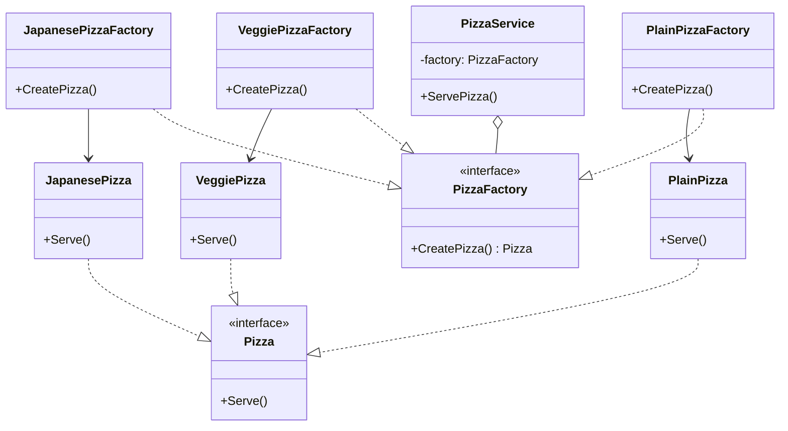

# Go Factory Method Example (Clean Architecture)

このプロジェクトは、**Go**言語で**Factory Method パターン**を説明するためのサンプルです。
「ピザ屋さん」を例に、ビジネスロジックから具象クラスを切り離して、柔軟に具材やトッピングを切り替える仕組みを体験します。

## 🍕 シナリオ: ピザ屋の注文フロー

ピザ屋では「プレーン」「ベジー」「和風」など複数のピザを提供しています。
`PizzaService` は `PizzaFactory` に注文を委ねるだけで具象クラスを知らず、依存性の注入（DI）により `main.go` で生成ルールを差し替えられます。
この Sample では Factory Method（構造体が `PizzaFactory` を実装）と、より軽量な Simple Factory（関数で分岐）という 2 種類の生成戦略を同時に学べます。

## 🏗 アーキテクチャ構成



### 各レイヤーの役割

1.  **Domain (`/domain`)**
    *   `Pizza`（Product Interface）：ピザを準備し、焼いて、切って、供する一連の流れ（`Prepare()`, `Bake()`, `Cut()`, `Serve()`）を定義。
    *   `PizzaFactory`（Creator Interface）：ピザを生成する責務だけを持つ。
2.  **Usecase (`/usecase`)**
    *   `PizzaService`：`PizzaFactory` を注入され、自身の依存先を知らずにピザを提供。
3.  **Adapter (`/adapter`)**
    *   **Concrete Factories**: `PlainPizzaFactory`, `VeggiePizzaFactory`, `JapanesePizzaFactory`。
    *   **Concrete Products**: `PlainPizza`, `VeggiePizza`, `JapanesePizza`。
    *   **Simple Factory**: `SimplePizzaFactory` 関数で文字列からピザを生成（テストや小さな構成で便利）。
    *   **Shared Base**: 各ピザは共通の `pizzaBase` を埋め込むことで `Prepare()`, `Bake()`, `Cut()`, `Serve()` の `"<Action> <Pizza name>..."` ログを提供しつつ、必要なステップだけ上書きして差分を表現しています。

## 💡 設計ノート

### Q1. なぜ `PizzaService` は直接 `&PlainPizza{}` を生成しないのでしょうか？
**A.** `PizzaService` は `PizzaFactory` 経由でピザを得ることで具象クラスへの依存を避け、テストや構成の切り替えを容易にしています。

###
`PizzaService` は `CreatePizza()` の結果に対して `Prepare()`, `Bake()`, `Cut()`, `Serve()` を順番に呼び出すことで、調理プロセス全体を担保し、各ピザに共通のライフサイクルを強制しています。たとえば `PlainPizzaFactory` と `VeggiePizzaFactory` に差があっても、同じ手順で配膳できます。

### Q2. `SimplePizzaFactory` はいつ使えばよいですか？
**A.** 小規模なモード切り替えでは Simple Factory で十分です。DI やモックが必要になるまでは文字列ベースで `PlainPizza`, `VeggiePizza`, `JapanesePizza` を生成できます。ただし分岐が増えると拡張しづらくなるので、その場合は Factory Method に戻します。

### Q3. `pizzaBase` の役割は何ですか？
**A.** 各ピザに埋め込まれた `pizzaBase` は `Prepare`, `Bake`, `Cut`, `Serve` の入り口を共通化し、`Preparing Plain Pizza...` のようなログを保ちます。個別のピザは必要なステップだけオーバーライドして差分を追加すれば、冗長なメソッドを何個も書かずに済みます。

## 🚀 実行方法

```bash
cd factory-example
go run main.go
```
