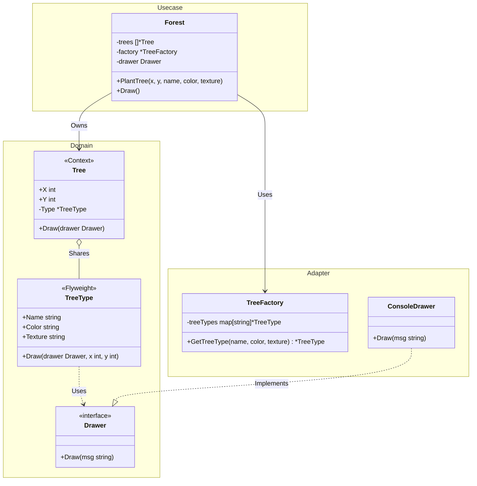

# Go Flyweight Pattern Example (Clean Architecture)

This project is an educational sample code that implements the **Flyweight Pattern** using the **Go** language. It demonstrates how to minimize memory usage by sharing as much data as possible with similar objects.

## What This Example Shows

- **Shared State (Intrinsic)**: Data that is constant and can be shared (e.g., Tree name, color, texture).
- **Unique State (Extrinsic)**: Data that varies and must be stored per instance (e.g., X, Y coordinates).
- **Factory Management**: Using a `TreeFactory` to ensure that identical Flyweights are reused rather than re-created.
- **Clean Architecture**: Separation of domain entities, factory logic (`adapter`), and orchestrating logic (`usecase`).

## Quick Start

In the `flyweight-example` directory:

```bash
go run main.go
```

## 🌲 Scenario: Massive Forest Rendering

Imagine a game where you need to render 1,000,000 trees.
If every `Tree` object stores its own name, texture, and color strings, you will quickly run out of memory.
Since many trees are of the same type (e.g., "Oak"), we extract that data into a shared **Flyweight** object (`TreeType`). Each individual `Tree` instance only stores its coordinates and a pointer to the shared type.

## 🏗 Architecture



### Role of Each Layer

1. **Domain (`/domain`)**: Contains the `TreeType` (Flyweight) and `Tree` (Context) logic. It defines the `Drawer` interface to avoid direct side effects.
2. **Usecase (`/usecase`)**: Contains the `Forest` logic, which acts as the manager for the collection of trees and uses the factory to optimize creation.
3. **Adapter (`/adapter`)**: Contains the `TreeFactory`, which handles the caching and reuse of Flyweights, and the `ConsoleDrawer` for output.

## 💡 Architectural Design Notes (Q&A)

### Q1. When should I use Flyweight?

**A. When your application uses a large number of objects and the storage cost is high.**
If most of the object state can be made extrinsic (moved outside the object), Flyweight allows you to replace many objects with a few shared ones.

### Q2. Is this the same as a Cache?

**A. They are related, but different in intent.**
A cache is usually about performance (saving time). Flyweight is specifically about **memory efficiency** (saving space) by structurally sharing data between objects that coexist.

## 🚀 How to Run

```bash
go run main.go
```