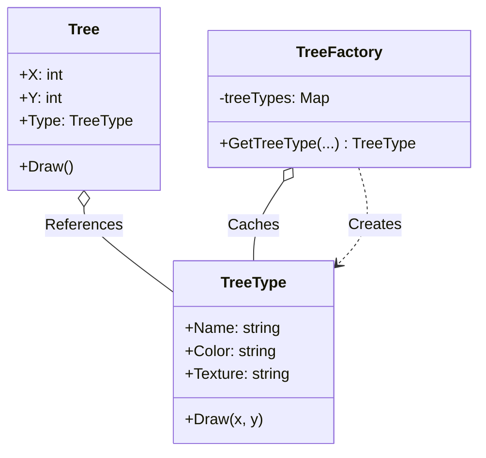

# Go Flyweight Pattern Example (Clean Architecture)

This project is an educational sample code that implements the **Flyweight Pattern** using the **Go** language. You will learn how to reduce memory usage by sharing common state among a large number of objects.

## What This Example Shows

- Splitting intrinsic state (`TreeType`) from extrinsic state (`Tree` position)
- Sharing/caching flyweights in a factory to reduce memory

## Quick Start

In the `flyweight-example` directory:

```bash
go run main.go
```

## 🌲 Scenario: Forest Rendering

Consider the case of rendering tens of thousands of "trees" in a game.
If each tree individually holds data for "color," "texture," and "polygon data," you will run out of memory no matter how much you have.
By separating the "type of tree (common data)" from the "location of the tree (individual data)" and sharing (caching) the type data, we can make it lightweight.

### Characters

1. **Flyweight (`domain.TreeType`)**: The shareable state (Intrinsic State). Data that does not change, such as color, texture, and name.
2. **Context (`domain.Tree`)**: The non-shareable state (Extrinsic State). Data that differs for each individual, such as coordinates (X, Y). It holds a reference to `TreeType`.
3. **Flyweight Factory (`adapter.TreeFactory`)**: A factory that manages `TreeType`. If the same type has already been created, it returns it; otherwise, it creates a new one and caches it.

## 🏗 Architecture Diagram



### Role of Each Layer

1. **Domain (`/domain`)**:
    * `TreeType`: The "heavy" data that consumes memory. This is treated as immutable.
    * `Tree`: Lightweight data. It only holds coordinates and a pointer to `TreeType`.
2. **Adapter (`/adapter`)**:
    * `TreeFactory`: Plays a singleton-like role and manages a pool of `TreeType`s.
    * `GetTreeType`: If a request with the same parameters (name, color, texture) comes in, it returns the existing instance. This is the key to saving memory.

## 💡 Architecture Design Notes (Q&A)

### Q1. How much memory can be saved?

**A. It depends on the number of objects and the size of the "shareable part."**

For example, if one tree has 1KB of data, 10,000 trees would take up 10MB.
However, if there are only two types, "Oak" and "Pine," using the Flyweight pattern, the memory usage would be for 2 `TreeType`s (2KB) + 10,000 coordinate data sets (a few KB), resulting in a dramatic reduction.

### Q2. Is Go's `sync.Map` necessary?

**A. It is necessary for concurrent processing.**

Although this sample runs on a single thread, in a real game server or web application where `GetTreeType` might be called from multiple goroutines simultaneously, it is necessary to make the Factory thread-safe using `sync.Mutex` or `sync.Map`.

## 🚀 How to Run

```bash
go run main.go
```

### Example Output

```text
=== Flyweight Pattern ===
Drawing Oak tree (Green, Rough) at (1, 1)
Drawing Oak tree (Green, Rough) at (2, 3)
Drawing Pine tree (DarkGreen, Smooth) at (5, 1)
Drawing Oak tree (Green, Rough) at (6, 6)

Total Tree Objects: 4
Total TreeTypes (Flyweights): 2
```

You can see that although there are 4 trees, only 2 instances of TreeType have been created.
