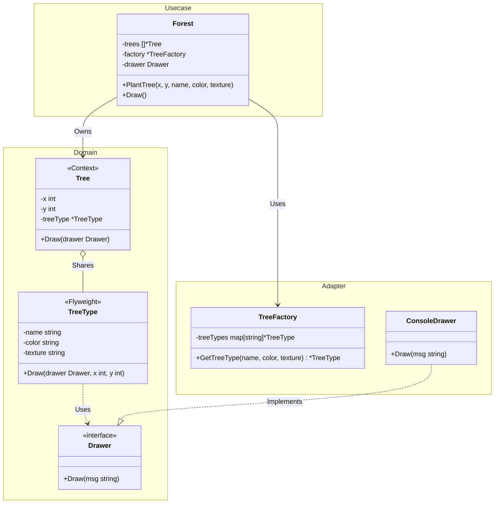

# Go Flyweight Pattern Example (Clean Architecture)

このプロジェクトは、**Go**言語を用いて**Flyweight Pattern（フライウェイトパターン）**を実装した教育用のサンプルコードです。類似したオブジェクト間で可能な限りデータを共有することで、メモリ使用量を最小限に抑える方法を学びます。

## この例で学べること

- **共有状態 (Intrinsic)**: 変更されず、共有可能なデータ（例：木の名称、色、テクスチャ）。
- **固有状態 (Extrinsic)**: インスタンスごとに異なり、保存が必要なデータ（例：X, Y 座標）。
- **ファクトリによる管理**: `TreeFactory` を使用して、同一の Flyweight が再生成されずに再利用されることを保証する方法。
- **Clean Architecture構成**: ドメインエンティティ、ファクトリロジック（`adapter`）、およびオーケストレーションロジック（`usecase`）の分離。

## すぐ試す

`flyweight-example` ディレクトリで実行します。

```bash
go run main.go
```

## 🌲 シナリオ：大量の森の描画

ゲームで 1,000,000 本の木を描画する必要があると想像してください。
すべての `Tree` オブジェクトが自身の名前、テクスチャ、色の文字列を保持していると、すぐにメモリが不足してしまいます。
多くの木は同じ種類（例：「オーク」）であるため、そのデータを共有の **Flyweight** オブジェクト（`TreeType`）に抽出します。各 `Tree` インスタンスは、座標と共有タイプへのポインタのみを保持します。

## 🏗 アーキテクチャ構成



### 各レイヤーの役割

1. **Domain (`/domain`)**: `TreeType` (Flyweight) と `Tree` (Context) のロジックを含みます。`NewTreeType`/`NewTree` で生成し、状態は非公開フィールドで保持します。直接的な副作用を避けるために `Drawer` インターフェースを定義しています。
2. **Usecase (`/usecase`)**: 木のコレクションを管理し、ファクトリを使用して生成を最適化する `Forest` ロジックを含みます。
3. **Adapter (`/adapter`)**: Flyweight のキャッシュと再利用を担当する `TreeFactory` と、出力用の `ConsoleDrawer` を含みます。

## 💡 アーキテクチャ設計ノート (Q&A)

### Q1. Flyweight はどのような時に使うべきですか？

**A. アプリケーションが大量のオブジェクトを使用しており、ストレージコストが高い時です。**
オブジェクトの状態の大部分を外部化（オブジェクト外に移動）できる場合、Flyweight を使用することで、多数のオブジェクトを少数の共有オブジェクトに置き換えることができます。

### Q2. これはキャッシュと同じですか？

**A. 関連していますが、意図が異なります。**
キャッシュは通常、パフォーマンス（時間の節約）を目的としています。Flyweight は特に、共存するオブジェクト間で構造的にデータを共有することによる **メモリ効率**（スペースの節約）を目的としています。

## 🚀 実行方法

```bash
go run main.go
```
