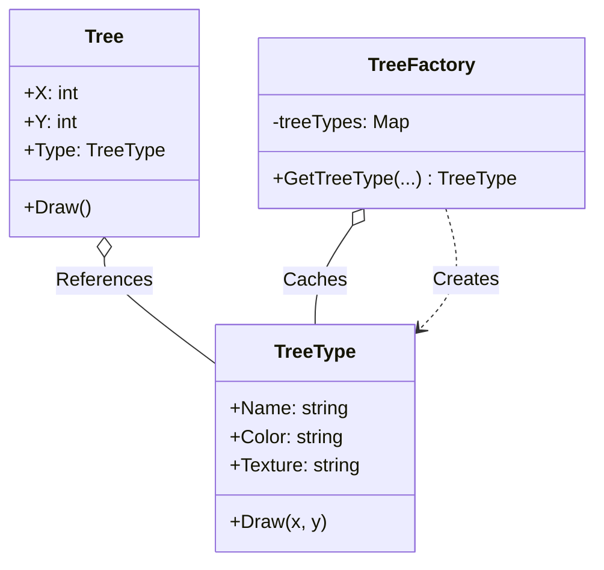

# Go Flyweight Pattern Example (Clean Architecture)

このプロジェクトは、**Go**言語を用いて**Flyweight Pattern（フライウェイトパターン）**を実装した教育用のサンプルコードです。多数のオブジェクト間で共通の状態を共有することで、メモリ使用量を削減する方法を学びます。

## 🌲 シナリオ: 森の描画 (Forest Rendering)

ゲームなどで数万本の「木」を描画する場合を考えます。
それぞれの木が「色」「テクスチャ」「ポリゴンデータ」を個別に持っていると、メモリがいくらあっても足りません。
木の「種類（共通データ）」と、木の「場所（個別データ）」を分け、種類データを共有（キャッシュ）することで軽量化します。

### 登場人物
1.  **Flyweight (`domain.TreeType`)**: 共有可能な状態（Intrinstic State）。色、テクスチャ、名前など、変化しないデータ。
2.  **Context (`domain.Tree`)**: 共有できない状態（Extrinsic State）。座標（X, Y）など、個体ごとに異なるデータ。`TreeType` への参照を持ちます。
3.  **Flyweight Factory (`adapter.TreeFactory`)**: `TreeType` を管理する工場。既に同じ種類が作られていればそれを返し、なければ新しく作ってキャッシュします。

## 🏗 アーキテクチャ構成



### 各レイヤーの役割

1.  **Domain (`/domain`)**:
    *   `TreeType`: メモリを食う「重い」データ。これは書き換え不可（Immutable）として扱います。
    *   `Tree`: 軽量なデータ。座標と、`TreeType` へのポインタだけを持ちます。
2.  **Adapter (`/adapter`)**:
    *   `TreeFactory`: シングルトン的な役割を果たし、`TreeType` のプールを管理します。
    *   `GetTreeType`: 同じパラメータ（名前、色、テクスチャ）のリクエストが来たら、既存のインスタンスを返します。これがメモリ節約の肝です。

## 💡 アーキテクチャ設計ノート (Q&A)

### Q1. どのくらいメモリが節約できますか？

**A. オブジェクトの数と「共有できる部分」の大きさに依存します。**

例えば、1本の木が1KBのデータを持つとして、1万本あれば10MBです。
しかし、種類が「オーク」と「松」の2種類しかなければ、Flyweightパターンを使うことで `TreeType` 2つ分（2KB） + 座標データ1万個分（数KB）で済み、劇的に削減できます。

### Q2. Goの `sync.Map` は必要ですか？

**A. 並行処理をするなら必要です。**

今回のサンプルはシングルスレッド動作ですが、実際のゲームサーバーやWebアプリで複数のゴルーチンから同時に `GetTreeType` が呼ばれる可能性がある場合は、`sync.Mutex` や `sync.Map` を使ってFactoryをスレッドセーフにする必要があります。

## 🚀 実行方法

```bash
go run main.go
```

### 実行結果の例

```text
=== Flyweight Pattern ===
Drawing Oak tree (Green, Rough) at (1, 1)
Drawing Oak tree (Green, Rough) at (2, 3)
Drawing Pine tree (DarkGreen, Smooth) at (5, 1)
Drawing Oak tree (Green, Rough) at (6, 6)

Total Tree Objects: 4
Total TreeTypes (Flyweights): 2
```

木は4本ありますが、TreeTypeの実体は2つしか生成されていないことがわかります。