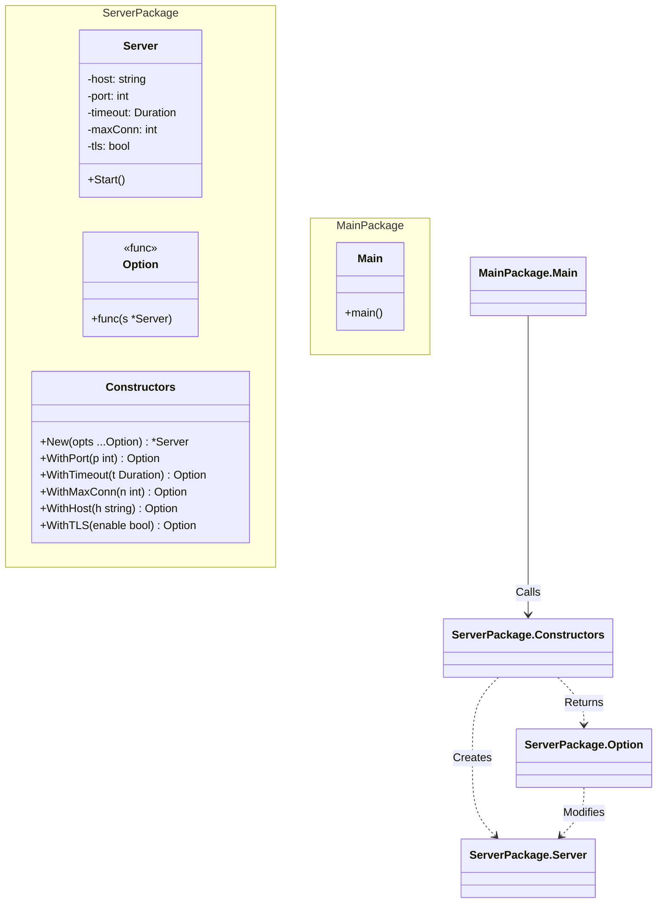

# Go Functional Options Pattern Example

This project is an implementation example of the very popular **Functional Options Pattern** in the **Go** language.
You will learn a technique to flexibly and readably set only the necessary parameters during struct initialization (`New`), while maintaining default values.
*Note: This is not one of the GoF design patterns, but it is a very important idiom in the Go language.*

## What This Example Shows

- Building a flexible constructor (`New`) with sensible defaults
- Overriding only the needed settings via option functions (e.g., `WithPort`, `WithTimeout`)
- **Package Encapsulation**: The logic resides in `pkg/server`, exposing only the API while keeping implementation details private.

## Quick Start

In the `functional-options-example` directory:

```bash
go run main.go
```

## ⚙️ Scenario: Server Configuration

When starting a server, there are many configuration items such as "port number," "timeout duration," and "maximum number of connections."
Creating a constructor that takes all of these as arguments is cumbersome.

```go
// Bad example: Too many arguments, making it unclear what is what
NewServer("localhost", 8080, 30, 100, true, false, ...)
```

Using the Functional Options pattern, you can write it as follows:

```go
// Good example: Only specify what you need, by name
server.New(
    server.WithPort(8080),
    server.WithTimeout(30 * time.Second),
)
```

## 🏗 Architecture Diagram



### Implementation Points

1. **Option type**: Define a function type that modifies the target struct, like `type Option func(*Server)`.
2. **With functions**: Create higher-order functions that return a closure, like `WithPort(p int) Option`.
3. **New function**: Accepts variadic arguments `opts ...Option`, and after setting up the instance with default settings, applies the option functions in a loop (`opt(s)`).

## 💡 Architecture Design Notes (Q&A)

### Q1. What is the difference from the Builder pattern?

**A. The difference is that it does not create a "stateful builder class."**

* **Builder**: A builder object temporarily holds the settings, like `b.SetA().SetB().Build()`.
* **Functional Options**: The function itself performs the configuration, so no intermediate object is needed. It works well with Go's variadic arguments feature and results in a very clean API.

### Q2. When should it be used?

**A. When creating a constructor with a mix of "required parameters" and "optional parameters."**

It is a common practice to make required items (e.g., DB connection string) normal arguments, and optional items (e.g., timeout, cache settings) as Options.
`func NewClient(dbUrl string, opts ...Option) *Client`

## 🚀 How to Run

```bash
go run main.go
```