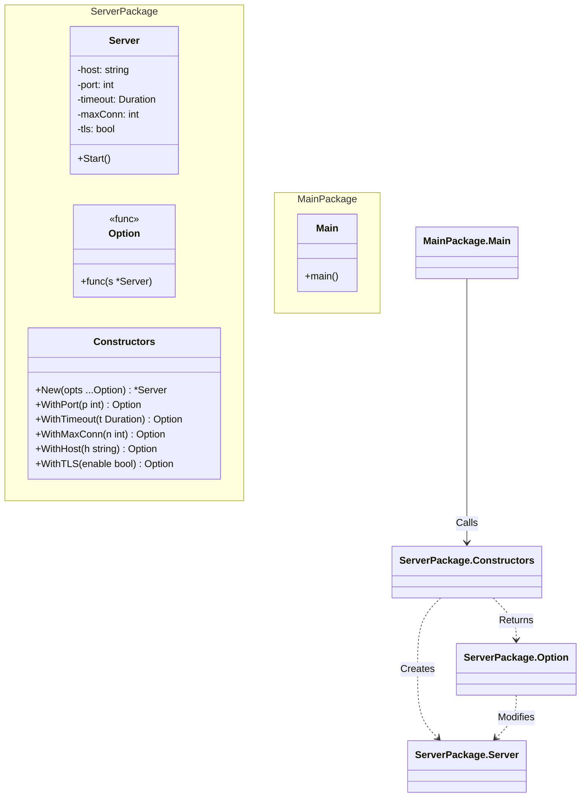

# Go Functional Options Pattern Example

このプロジェクトは、**Go**言語で非常に人気のある**Functional Options Pattern（ファンクショナル・オプション・パターン）**の実装例です。
構造体の初期化（`New`）において、デフォルト値を維持しつつ、必要なパラメータだけを柔軟かつ可読性高く設定するテクニックを学びます。
*※これはGoFデザインパターンではありませんが、Go言語における最重要イディオムの一つです。*

## この例で学べること

- 適切なデフォルト値を持つ柔軟なコンストラクタ（`New`）の構築
- オプション関数（`WithPort`, `WithTimeout` など）を使った設定の上書き
- **パッケージのカプセル化**: ロジックを `pkg/server` に配置し、APIのみを公開して実装詳細を隠蔽する方法

## すぐ試す

`functional-options-example` ディレクトリで実行します。

```bash
go run main.go
```

## ⚙️ シナリオ：サーバー設定

サーバーを起動する際、「ポート番号」「タイムアウト時間」「最大接続数」など多くの設定項目があります。
これら全てを引数に取るコンストラクタを作ると大変です。

```go
// 悪い例：引数が多すぎて、何が何だかわからない
NewServer("localhost", 8080, 30, 100, true, false, ...)
```

Functional Optionsパターンを使うと、以下のように書けます。

```go
// 良い例：必要なものだけを名前付きで指定できる
server.New(
    server.WithPort(8080),
    server.WithTimeout(30 * time.Second),
)
```

## 🏗 アーキテクチャ構成図



### 実装のポイント

1. **Option型**: `type Option func(*Server)` のように、対象の構造体を変更する関数型を定義します。
2. **With関数**: `WithPort(p int) Option` のように、クロージャを返す高階関数を作成します。
3. **New関数**: 可変長引数 `opts ...Option` を受け取り、デフォルト設定でインスタンスを作った後、ループでオプション関数を適用（`opt(s)`）します。

## 💡 アーキテクチャ設計ノート (Q&A)

### Q1. Builderパターンとの違いは？

**A. 「状態を持つBuilderクラス」を作らない点が違います。**

* **Builder**: `b.SetA().SetB().Build()` のように、Builderオブジェクトが一時的に設定を保持します。
* **Functional Options**: 関数そのものが設定を行うため、中間オブジェクトが不要です。Goの可変長引数機能と相性が良く、APIが非常にスッキリします。

### Q2. どんな時に使うべき？

**A. 「必須パラメータ」と「任意パラメータ」が混在するコンストラクタを作る時です。**

必須項目（例：DB接続文字列）は通常の引数にし、任意項目（例：タイムアウト、キャッシュ設定）をOptionにするのが定石です。
`func NewClient(dbUrl string, opts ...Option) *Client`

## 🚀 実行方法

```bash
go run main.go
```