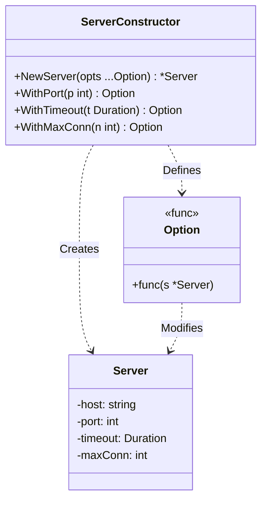

# Go Functional Options Pattern Example

このプロジェクトは、**Go**言語で非常に人気のある**Functional Options Pattern（ファンクショナル・オプション・パターン）**の実装例です。
構造体の初期化(`NewServer`)時に、デフォルト値を維持しつつ、必要なパラメータだけを柔軟かつ可読性高く設定するテクニックを学びます。
※これはGoFのデザインパターンではありませんが、Go言語のイディオムとして非常に重要です。

## ⚙️ シナリオ: サーバーの設定 (Configuration)

サーバーを起動する際、「ポート番号」「タイムアウト時間」「最大接続数」など多くの設定項目があります。
これらをすべて引数にとるコンストラクタを作ると大変です。
```go
// 悪い例: 引数が多すぎて何が何だかわからない
NewServer("localhost", 8080, 30, 100, true, false, ...)
```
Functional Optionsパターンを使うと、以下のように書けます。
```go
// 良い例: 必要なものだけ名前付きで指定できる
NewServer(
    WithPort(8080),
    WithTimeout(30 * time.Second),
)
```

## 🏗 アーキテクチャ構成



### 実装のポイント

1.  **Option型**: `type Option func(*Server)` のように、対象の構造体を変更する関数型を定義します。
2.  **With関数**: `WithPort(p int) Option` のように、クロージャを返す高階関数を作ります。
3.  **New関数**: 可変長引数 `opts ...Option` を受け取り、デフォルト設定を行った後のインスタンスに対して、ループでオプション関数を適用(`opt(s)`)します。

## 💡 アーキテクチャ設計ノート (Q&A)

### Q1. Builderパターンとの違いは？

**A. 「状態を持つビルダークラス」を作らない点が異なります。**

*   **Builder**: `b.SetA().SetB().Build()` のように、ビルダーオブジェクトが一時的に設定値を保持します。
*   **Functional Options**: 関数そのものが設定処理を行うため、中間オブジェクトが不要です。Goの可変長引数機能と相性が良く、APIが非常にスッキリします。

### Q2. いつ使うべきですか？

**A. 「必須パラメータ」と「任意パラメータ」が混在するコンストラクタを作る時です。**

必須なもの（例：DB接続文字列など）は通常の引数にし、任意なもの（例：タイムアウト、キャッシュ設定など）をOptionsにするのが定石です。
`func NewClient(dbUrl string, opts ...Option) *Client`

## 🚀 実行方法

```bash
go run main.go
```