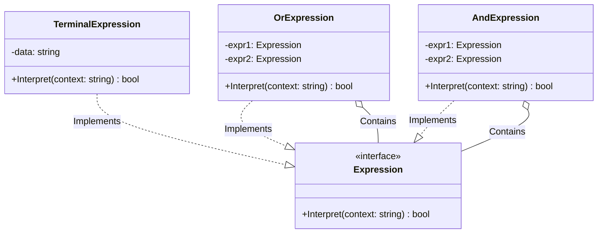

# Go Interpreter Pattern Example (Clean Architecture)

This project is an educational sample code that implements the **Interpreter Pattern** using the **Go** language. You will learn how to define a simple language or grammar and create a class structure to interpret and execute it.

## What This Example Shows

- Building an expression tree from small objects (AST)
- Evaluating the tree with `Interpret(context)` using terminal and non‑terminal expressions

## Quick Start

In the `interpreter-example` directory:

```bash
go run main.go
```

## 🗣 Scenario: Simple Logical Expression Evaluation

We will create a simple interpreter that defines rules such as "Robert is a male" and "Julie is a married woman," and determines whether the input text meets those conditions.
Logical operations like AND (`&&`) and OR (`||`) are represented by combining objects.

### Characters

1. **Abstract Expression (`domain.Expression`)**: A common interface. It has an `Interpret(context)` method.
2. **Terminal Expression (`adapter.TerminalExpression`)**: The end of the grammar (terminal symbol). An element that cannot be broken down further (e.g., checking if the word "Robert" is included).
3. **Non-Terminal Expression (`adapter.OrExpression`, `adapter.AndExpression`)**: The rules of the grammar (non-terminal symbol). They process by combining other Expressions.

## 🏗 Architecture Diagram



### Role of Each Layer

1. **Domain (`/domain`)**:
    * `Expression`: A contract to "interpret a context and return a boolean."
2. **Adapter (`/adapter`)**:
    * `TerminalExpression`: Determines if it matches specific data (a word).
    * `OrExpression` / `AndExpression`: Returns the result of a logical operation on its child elements (`expr1`, `expr2`). This forms a recursive tree structure (AST: Abstract Syntax Tree).

## 💡 Architecture Design Notes (Q&A)

### Q1. Can't I just use Regular Expressions (Regex)?

**A. For simple pattern matching, regular expressions are suitable.**

The Interpreter pattern shines when you want to **"create your own language"** or when **"the grammar is frequently changed or extended."**
For example, when building a SQL parser or a specific Domain-Specific Language (DSL) engine, regular expressions have their limits, but with the Interpreter pattern, you can support new grammar elements just by adding a class.

### Q2. How is the performance?

**A. Generally, it's not very good.**

Since many small objects are created and recursive calls are frequent, it is slower compared to compiled languages or optimized engines.
If you are dealing with an overly complex grammar, you should consider introducing a parser generator (like yacc/bison/antlr) or a bytecode compiler.

## 🚀 How to Run

```bash
go run main.go
```
