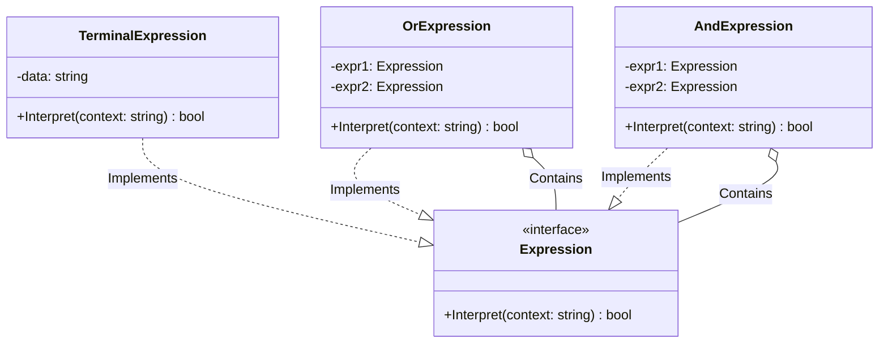

# Go Interpreter Pattern Example (Clean Architecture)

このプロジェクトは、**Go**言語を用いて**Interpreter Pattern（インタープリタパターン）**を実装した教育用のサンプルコードです。簡単な言語や文法を定義し、それを解釈・実行するクラス構造を作る方法を学びます。

## 🗣 シナリオ: シンプルな論理式判定

「Robert は男性である」「Julie は既婚女性である」といったルールを定義し、
入力されたテキストがその条件を満たすかどうかを判定するシンプルなインタープリタを作ります。
AND (`&&`) や OR (`||`) の論理演算をオブジェクトの組み合わせで表現します。

### 登場人物
1.  **Abstract Expression (`domain.Expression`)**: 共通インターフェース。`Interpret(context)` メソッドを持ちます。
2.  **Terminal Expression (`adapter.TerminalExpression`)**: 文法の末端（終端記号）。これ以上分解できない要素（例：「Robert」という単語が含まれるかチェック）。
3.  **Non-Terminal Expression (`adapter.OrExpression`, `adapter.AndExpression`)**: 文法のルール（非終端記号）。他のExpressionを組み合わせて処理します。

## 🏗 アーキテクチャ構成



### 各レイヤーの役割

1.  **Domain (`/domain`)**:
    *   `Expression`: 「文脈(context)を解釈して、真偽(bool)を返す」という契約。
2.  **Adapter (`/adapter`)**:
    *   `TerminalExpression`: 具体的なデータ（単語）と一致するか判定します。
    *   `OrExpression` / `AndExpression`: 子要素(`expr1`, `expr2`)の結果を論理演算して返します。これが再帰的なツリー構造（AST: 抽象構文木）になります。

## 💡 アーキテクチャ設計ノート (Q&A)

### Q1. 正規表現（Regex）ではダメなのですか？

**A. 簡単なパターンマッチなら正規表現が適しています。**

Interpreterパターンは、**「独自の言語を作りたい」** **「文法が頻繁に変更・拡張される」** 場合に威力を発揮します。
例えば、SQLパーサーや、特定のドメイン固有言語（DSL）エンジンを作る場合、正規表現では限界がありますが、Interpreterパターンならクラスを追加するだけで新しい文法要素に対応できます。

### Q2. パフォーマンスはどうですか？

**A. 一般的に、あまり良くありません。**

多数の小さなオブジェクトが生成され、再帰呼び出しが頻発するため、コンパイル言語や最適化されたエンジンに比べると遅くなります。
複雑すぎる文法を扱う場合は、パーサージェネレータ（yacc/bison/antlr）や、バイトコードコンパイラの導入を検討すべきです。

## 🚀 実行方法

```bash
go run main.go
```