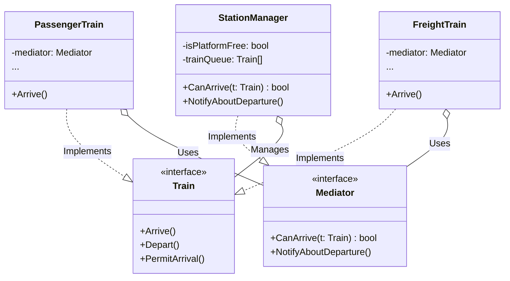

# Go Mediator Pattern Example (Clean Architecture)

This project is an educational sample code that implements the **Mediator Pattern** using the **Go** language. It resolves complex dependencies (spaghetti code) by having objects coordinate through a mediator, rather than communicating directly with each other.

## 🚉 Scenario: Station Platform Management

Multiple trains (passenger trains, freight trains) arrive at a station platform.
If the trains were to communicate directly with each other ("Are you at the platform now?", "Can I enter?"), it would become unmanageable as the number of trains increases (N-to-N communication).
We introduce a mediator called the "Station Manager," and all trains will only communicate with the station manager.

### Characters

1. **Mediator (`domain.Mediator`)**: The coordinator interface. It has `CanArrive` (Can I arrive?) and `NotifyAboutDeparture` (I have departed).
2. **Colleague (`domain.Train`)**: The interface representing a train. It holds a reference to the Mediator.
3. **Concrete Mediator (`adapter.StationManager`)**: Manages platform availability and directs traffic.
4. **Concrete Colleague (`adapter.PassengerTrain`, `adapter.FreightTrain`)**: Specific types of trains.

## 🏗 Architecture



### Role of Each Layer

1. **Domain (`/domain`)**:
    * `Mediator`: The contract with the coordinator.
    * `Train`: The contract for the participants (colleagues).
2. **Adapter (`/adapter`)**:
    * `StationManager`: The concrete coordination logic. It makes decisions like "permit if the platform is free, otherwise add to a queue to wait."
    * `Train`: Does not make decisions on its own; it always seeks instructions by calling `mediator.CanArrive(this)`.

## 💡 Architectural Design Notes (Q&A)

### Q1. What's the difference from the Facade pattern?

**A. The "direction" and "purpose" of communication are different.**

* **Facade**: It's "unidirectional." It simply provides an easy-to-use entry point to a complex subsystem from the outside. The subsystem is unaware of the Facade.
* **Mediator**: It's "bidirectional." The Colleagues know the Mediator, and the Mediator knows the Colleagues. It's used to organize the collaborative behavior of internal members.

### Q2. Are there any disadvantages?

**A. The Mediator class tends to become large and complex (the God Class problem).**

Since all logic is concentrated in the Mediator, it is prone to becoming bloated. It may be necessary to devise ways to properly divide responsibilities or extract some of the logic into other classes.

## 🚀 How to Run

```bash
go run main.go
```
