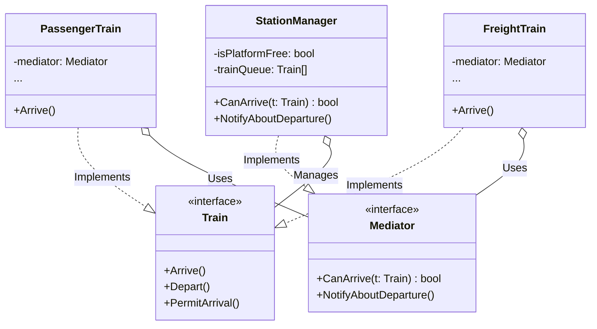

# Go Mediator Pattern Example (Clean Architecture)

このプロジェクトは、**Go**言語を用いて**Mediator Pattern（メディエーターパターン）**を実装した教育用のサンプルコードです。オブジェクト同士が直接通信し合うのではなく、仲介者（Mediator）を通して協調動作を行うことで、複雑な依存関係（スパゲッティコード）を解消します。

## 🚉 シナリオ: 駅のプラットフォーム管理

駅のプラットフォームに複数の列車（旅客列車、貨物列車）が到着します。
もし列車同士が「君、今ホームにいる？」「僕が入ってもいい？」と直接通信し合うと、列車の数が増えたときに収集がつかなくなります（N対Nの通信）。
「駅長（StationManager）」という仲介者を置き、全ての列車は駅長とだけ会話するようにします。

### 登場人物
1.  **Mediator (`domain.Mediator`)**: 調整役のインターフェース。`CanArrive`（到着していい？）、`NotifyAboutDeparture`（出発したよ）を持ちます。
2.  **Colleague (`domain.Train`)**: 列車を表すインターフェース。Mediatorへの参照を持ちます。
3.  **Concrete Mediator (`adapter.StationManager`)**: プラットフォームの空き状況を管理し、交通整理を行います。
4.  **Concrete Colleague (`adapter.PassengerTrain`, `adapter.FreightTrain`)**: 具体的な列車。

## 🏗 アーキテクチャ構成



### 各レイヤーの役割

1.  **Domain (`/domain`)**:
    *   `Mediator`: 調整役との契約。
    *   `Train`: 参加者（同僚）との契約。
2.  **Adapter (`/adapter`)**:
    *   `StationManager`: 具体的な調整ロジック。「プラットフォームが空いていれば許可、空いていなければキューに入れて待機させる」という判断を行います。
    *   `Train`: 自分で判断せず、必ず `mediator.CanArrive(this)` を呼んで指示を仰ぎます。

## 💡 アーキテクチャ設計ノート (Q&A)

### Q1. Facadeパターンとの違いは？

**A. 通信の「方向」と「目的」が違います。**

*   **Facade**: 「一方向」です。複雑なサブシステムに対して、外部から使いやすい窓口を提供するだけです。サブシステム側はFacadeのことを知りません。
*   **Mediator**: 「双方向」です。ColleagueはMediatorを知っており、MediatorもColleagueを知っています。内部のメンバー同士の協調動作を整理するために使います。

### Q2. デメリットはありますか？

**A. Mediatorクラスが巨大化・複雑化しやすいこと（神クラス問題）です。**

全てのロジックがMediatorに集中するため、ここが肥大化しがちです。
適切に責任を分割するか、ロジックの一部を別のクラスに切り出すなどの工夫が必要になることがあります。

## 🚀 実行方法

```bash
go run main.go
```