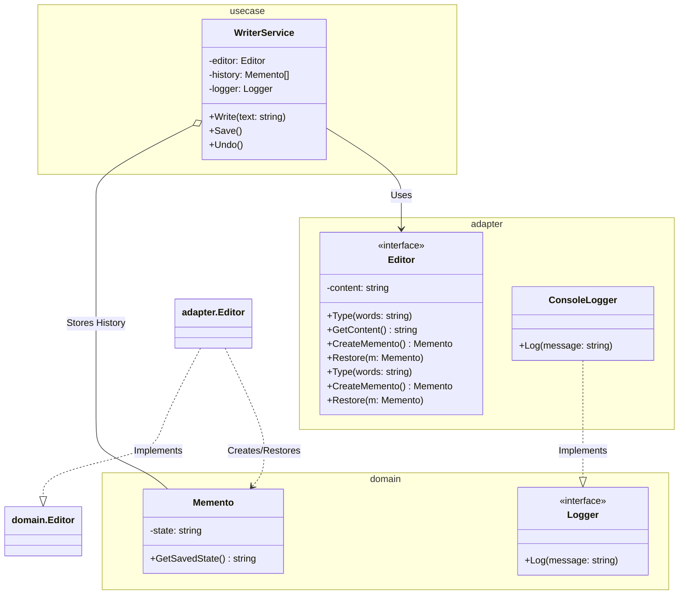

# Go Memento Pattern Example (Clean Architecture)

This project is an educational sample code that implements the **Memento Pattern** using the **Go** language. You will learn how to save and later restore the internal state of an object without violating its implementation details (encapsulation).

## What This Example Shows

- Capturing editor state as immutable mementos
- Restoring previous states without exposing internal details
- Managing the history of states using a Caretaker (`WriterService`)

## Quick Start

In the `memento-example` directory:

```bash
go run main.go
```

## 📝 Scenario: Text Editor's Undo Feature

When writing in a text editor, you want to be able to revert to a "past state" at any time.
However, allowing external code to directly manipulate the editor's internal variables (like `content`) can lead to unexpected bugs.
By creating a dedicated storage box called a "Memento," packing the state into it, and entrusting it to an external party (Caretaker), we can safely manage snapshots.

### Characters

1. **Originator (`adapter.Editor`)**: The object that has the state. It provides functions to "create a snapshot (`CreateMemento`)" and "restore from a snapshot (`Restore`)."
2. **Memento (`domain.Memento`)**: The storage box for the state. It holds the state, but it is designed so that no one other than the Originator can modify it (controlled by field visibility in Go).
3. **Caretaker (`usecase.WriterService`)**: The manager of Mementos. It stores Mementos (managing history with an array) but does not tamper with the contents of the Memento. It orchestrates the writing and undoing process.

## 🏗 Architecture



### Role of Each Layer

1. **Domain (`/domain`)**:
    * `Memento`: A struct that only holds the state.
    * `Editor` (Interface): Defines the behavior of the editor (typing, saving state, restoring).
2. **Usecase (`/usecase`)**:
    * `WriterService` (Caretaker): Manages the writing process and the history of Mementos. It decides when to save a snapshot and when to undo.
3. **Adapter (`/adapter`)**:
    * `Editor` (Originator Implementation): Holds the current text in memory. It creates a Memento by copying its current state.
    * `ConsoleLogger`: Outputs logs to the console.

## 💡 Architectural Design Notes (Q&A)

### Q1. What's the difference between this and the Undo in the Command Pattern?

**A. The approach differs between "replaying an operation in reverse" and "saving a state."**

* **Command**: Remembers the "last operation (e.g., adding text)" and executes the "reverse operation (e.g., deleting text)" for an Undo. It's memory-efficient, but defining the reverse operation can be difficult.
* **Memento**: Copies and saves the "state at a certain point in time" wholesale. The implementation is simple, but it can consume a lot of memory if the state is large (e.g., huge image data).

### Q2. What are the limits of encapsulation in Go?

**A. There is no feature exactly like "friend classes."**

In a strict Memento pattern, it's ideal that "only the Originator can see the contents of the Memento."
In Go, you can restrict access from external packages by using package-private fields (lowercase), but they can still be accessed from within the same package.
This sample uses a simplified implementation for learning purposes, but in production, `Memento` might be in a separate package or use private fields with restricted accessors to ensure better encapsulation.

## 🚀 How to Run

```bash
go run main.go
```