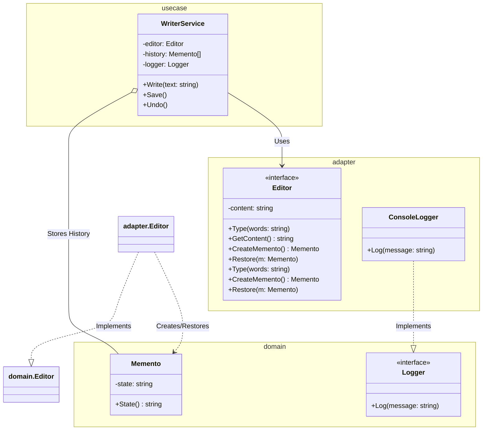

# Go Memento Pattern Example (Clean Architecture)

このプロジェクトは、**Go**言語を用いて**Memento Pattern（メメントパターン）**を実装した教育用のサンプルコードです。オブジェクトの実装詳細（カプセル化）を破ることなく、内部状態を保存し、後で復元する方法を学びます。

## この例で学べること

- エディタの状態を不変の Memento として保存する
- 内部構造を公開せずに過去の状態に復元する
- Caretaker (`WriterService`) を使って履歴管理を行う

## すぐ試す

`memento-example` ディレクトリで実行します。

```bash
go run main.go
```

## 📝 シナリオ: テキストエディタのUndo機能

テキストエディタで文章を書いているとき、いつでも「過去の状態」に戻したい場合があります。
しかし、エディタ内部の変数（`content`など）を外部から直接操作させると、予期せぬバグの元になります。
そこで「Memento（記念品）」という専用の保存箱を作り、そこに状態を詰め込んで外部（Caretaker）に預けておくことで、安全にスナップショットを管理します。

### 登場人物

1.  **Originator (`adapter.Editor`)**: 状態を持っている本人。「スナップショットを作る(`CreateMemento`)」「スナップショットから復元する(`Restore`)」機能を提供します。
2.  **Memento (`domain.Memento`)**: 状態の保存箱。パッケージ非公開フィールドと読み取り用アクセサで、Originator以外が中身を変更できないようにします。
3.  **Caretaker (`usecase.WriterService`)**: Mementoの管理人。Mementoを預かっておきます（配列などで履歴管理）が、Mementoの中身を勝手にいじったりはしません。

## 🏗 アーキテクチャ構成



### 各レイヤーの役割

1.  **Domain (`/domain`)**:
    *   `Memento`: 状態だけを持つ構造体（`NewMemento`で生成し、読み取り専用のアクセサで取得）。
    *   `Editor` (Interface): エディタの振る舞い（入力、保存、復元）を定義します。
2.  **Usecase (`/usecase`)**:
    *   `WriterService` (Caretaker): 文章の作成プロセスとMementoの履歴を管理します。いつ保存し、いつUndoするかを制御します。
3.  **Adapter (`/adapter`)**:
    *   `Editor` (Originator Implementation): 現在のテキストをメモリ上に保持します。`CreateMemento`で現在の状態をコピーして返します。
    *   `ConsoleLogger`: コンソールへのログ出力を行います。

## 💡 アーキテクチャ設計ノート (Q&A)

### Q1. CommandパターンのUndoとは何が違う？

**A. 「操作を逆再生する」か「状態をまるごと保存する」かのアプローチが違います。**

*   **Command**: 「最後の操作（例：文字追加）」を覚えておき、Undo時に「逆の操作（例：文字削除）」を実行します。メモリ効率は良いですが、逆操作の定義が難しい場合があります。
*   **Memento**: 「ある時点の状態」をまるごとコピーして保存します。実装は単純ですが、状態が巨大（例：巨大な画像データ）だとメモリを食います。

### Q2. Goでのカプセル化の限界は？

**A. 「フレンドクラス」のような機能はありません。**

厳密なMementoパターンでは「Mementoの中身はOriginatorしか見れない」のが理想です。
Goではパッケージプライベート（小文字フィールド）にすることで外部パッケージからのアクセスは防げますが、同一パッケージ内からは見えてしまいます。
このサンプルでは学習用として簡易的な実装にしていますが、本番ではパッケージを分けるなどの工夫が必要になることもあります。

## 🚀 実行方法

```bash
go run main.go
```
