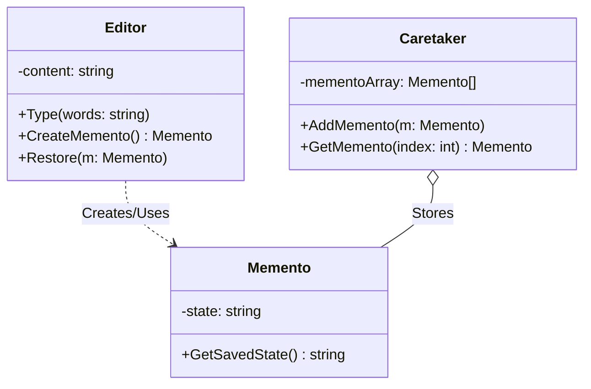

# Go Memento Pattern Example (Clean Architecture)

このプロジェクトは、**Go**言語を用いて**Memento Pattern（メメントパターン）**を実装した教育用のサンプルコードです。オブジェクトの実装詳細（カプセル化）を破壊せずに、その内部状態を保存し、後で復元する方法を学びます。

## この例で学べること

- 状態を Memento として保存し、内部詳細を漏らさず復元できる仕組み
- Caretaker が履歴を保持し、Originator が復元する流れ

## すぐ試す

`memento-example` ディレクトリで実行します。

```bash
go run main.go
```

## 📝 シナリオ: テキストエディタのUndo機能

テキストエディタで文章を書いているとき、いつでも「過去の状態」に戻れるようにしたいです。
しかし、エディタの内部変数（`content`など）を外部から直接いじらせると、予期せぬバグの原因になります。
「Memento」という専用の保管箱を作り、そこに状態を詰め込んで外部（Caretaker）に預けることで、安全にスナップショットを管理します。

### 登場人物
1.  **Originator (`adapter.Editor`)**: 状態を持つ本人。「スナップショットを作成する(`CreateMemento`)」「スナップショットから復元する(`Restore`)」機能を提供します。
2.  **Memento (`domain.Memento`)**: 状態の保管箱。中身（State）を持っていますが、Originator以外からは変更できないようにします（Goではフィールドの可視性で制御）。
3.  **Caretaker (`adapter.Caretaker`)**: Mementoの管理人。Mementoを保管（配列で履歴管理）しますが、Mementoの中身を勝手にいじったりはしません。

## 🏗 アーキテクチャ構成



### 各レイヤーの役割

1.  **Domain (`/domain`)**:
    *   `Memento`: 状態を保持するだけの構造体。
2.  **Adapter (`/adapter`)**:
    *   `Editor` (Originator): 現在のテキストを持っています。`CreateMemento` で現在の状態をコピーして Memento を作ります。
    *   `Caretaker`: 履歴リスト（StackやArray）を管理するUIやマネージャに相当します。「元に戻す」ボタンが押されたら、過去の Memento を取り出して Editor に渡します。

## 💡 アーキテクチャ設計ノート (Q&A)

### Q1. コマンドパターン(Command)のUndoと何が違いますか？

**A. アプローチが「操作の逆再生」か「状態の保存」かで異なります。**

*   **Command**: 「直前の操作（文字追加など）」を記憶し、Undoの際は「逆の操作（文字削除）」を実行します。メモリ効率は良いですが、逆操作の定義が難しい場合があります。
*   **Memento**: 「ある時点の状態」を丸ごとコピーして保存します。実装は簡単ですが、状態が大きい場合（巨大な画像データなど）はメモリを大量に消費します。

### Q2. Goでのカプセル化の限界は？

**A. 完全な「フレンドクラス」のような機能はありません。**

厳密なMementoパターンでは「Mementoの中身はOriginatorしか見れない」のが理想です。
Goではパッケージプライベート（小文字）を使うことで外部パッケージからのアクセスを制限できますが、同じパッケージ内であればアクセスできてしまいます。
このサンプルでは学習用として簡易的に実装しています。

## 🚀 実行方法

```bash
go run main.go
```
