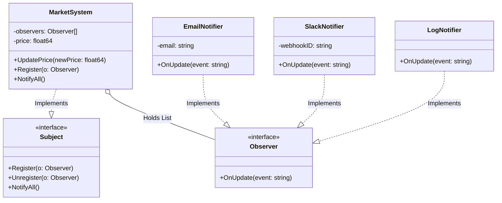

# Go Observer Pattern Example (Clean Architecture)

This project is an educational sample code that implements the **Observer Pattern** using the **Go** language. You will learn a mechanism to notify multiple listeners of state changes (events) in a loosely coupled manner.

## What This Example Shows

- Notifying multiple observers when a subject’s state changes
- Adding/removing observers without changing the subject logic

## Quick Start

In the `observer-example` directory:

```bash
go run main.go
```

## 📡 Scenario: Market Price Monitoring System

When the price of something like "Bitcoin" changes, a notification is automatically sent to all registered destinations (Email, Slack, logs). The notifier (Subject) does not know the specific implementation of the notified parties (Observers).

### Characters

1. **Subject (`usecase.MarketSystem`)**: The object being monitored. It holds price data and a "list of observers."
2. **Observer (`domain.Observer`)**: The interface for receiving notifications.
3. **Concrete Observer (`adapter.EmailNotifier` etc)**: The specific means of notification (sending an email, posting to Slack, etc.).

## 🏗 Architecture



### Role of Each Layer

1. **Domain (`/domain`)**:
    * `Observer`: The interface definition for receiving notifications. It only defines the contract "let me know if something happens (`OnUpdate`)."
2. **Usecase (`/usecase`)**:
    * `MarketSystem`: The entity that manages the state (price).
    * When the price changes (`UpdatePrice`), it calls `NotifyAll` on itself to contact all registered Observers. **It does not know who it is contacting (Email or Slack)**.
3. **Adapter (`/adapter`)**:
    * `EmailNotifier` / `SlackNotifier`: The actual notification processing.
    * They are called by the Usecase, but the Usecase does not depend on their specific implementations (as they are called via the `domain.Observer` interface).

## 💡 Architectural Design Notes (Q&A)

### Q1. Why is this pattern necessary?

**A. To decouple the "notifier" from the "notified."**

If written without the Observer pattern, the `usecase` would look like this:

```go
// Bad example
func (m *MarketSystem) UpdatePrice(price float64) {
    m.price = price
    adapter.SendEmail(...) // Dependency!
    adapter.PostSlack(...) // Dependency!
    adapter.WriteLog(...)  // Dependency!
}
```

With this approach, every time a new notification destination (e.g., SMS notification) is added, **the business logic (Usecase) needs to be rewritten**. This violates the "Open/Closed Principle (OCP)."
With the Observer pattern, you can add functionality just by calling `Register` in `main.go`, without touching the Usecase at all.

### Q2. How is this different from Go's Channels?

**A. The purpose is similar, but the synchronous/asynchronous approach is different.**

* **This Implementation (Interface)**:
  * It's **synchronous**. Since `NotifyAll` loops through and calls functions, the program does not proceed to the next step until all notifications are complete. It's suitable for cases where you want to ensure notification.
* **Go Channels**:
  * They are suited for **asynchronous** event handling. It's possible to have the Observer side hold a `chan string`, and the sender side just throws data into the channel (Fire-and-Forget).
  * While Channels are used for more advanced concurrent processing, the interface-based type in this example serves as the fundamental structural design.

## 🚀 How to Run

```bash
go run main.go
```

### Example Output

```text
=== Observer Pattern Market Demo ===
Setting up listeners...

[Market] Updating price from $30000.00 to $32000.00

--- 📢 Notifying 3 observers ---
📧 [Email to investor@example.com] Received update: Price of 'Bitcoin' changed to $32000.00
💬 [Slack #crypto-alerts] 🚨 Notification: Price of 'Bitcoin' changed to $32000.00
📝 [System Log] Event recorded: Price of 'Bitcoin' changed to $32000.00

Unsubscribing email user...

[Market] Updating price from $32000.00 to $29000.00

--- 📢 Notifying 2 observers ---
💬 [Slack #crypto-alerts] 🚨 Notification: Price of 'Bitcoin' changed to $29000.00
📝 [System Log] Event recorded: Price of 'Bitcoin' changed to $29000.00
```
