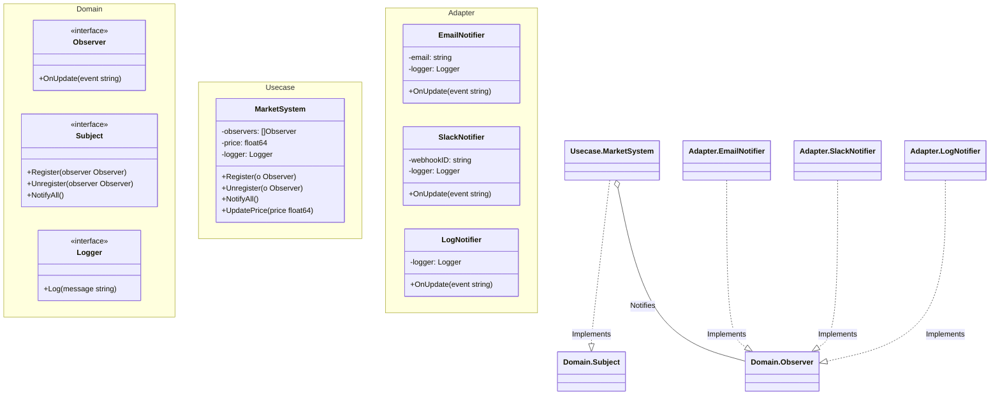

# Go Observer Pattern Example (Clean Architecture)

This project is an educational sample code that implements the **Observer Pattern** using the **Go** language. It demonstrates how to define a one-to-many dependency between objects so that when one object changes state, all its dependents are notified automatically.

## What This Example Shows

- **Event Notification**: Triggering updates to multiple listeners (Email, Slack, Log) when the Subject (Market) changes state.
- **Dynamic Registration**: Listeners can subscribe or unsubscribe at runtime.
- **Interface-Based Coupling**: The Subject (`MarketSystem`) only knows the `Observer` interface, not the concrete implementations (`EmailNotifier`).

## 📢 Scenario: Bitcoin Market Tracker

You have a `MarketSystem` that tracks the price of Bitcoin.
Various clients want to know when the price changes:
- An **Investor** wants an **Email**.
- A **Trader** wants a **Slack** alert.
- The **System** needs a **Log** entry.

Instead of hardcoding these calls into `UpdatePrice`, the MarketSystem allows these entities to "Subscribe" as Observers.

## 🏗 Architecture



### Role of Each Layer

1. **Domain (`/domain`)**:
    * `Observer`: The interface for receiving updates (`OnUpdate`).
    * `Subject`: The interface for managing subscriptions.
2. **Usecase (`/usecase`)**:
    * `MarketSystem`: The Concrete Subject. It holds the state (`price`) and the list of subscribers. When price changes, it iterates through the list and calls `OnUpdate`.
3. **Adapter (`/adapter`)**:
    * `EmailNotifier`, `SlackNotifier`: Concrete Observers. They implement `OnUpdate` to perform specific actions (sending email, posting to Slack).

## 💡 Architectural Design Notes (Q&A)

### Q1. Push vs Pull Model?

**A. This example uses the Push Model.**
The Subject sends the data (`event string`) directly to the Observer.
In a **Pull Model**, the Subject would just say "I changed", and the Observer would call `subject.GetPrice()` to fetch details.

### Q2. Is this thread-safe?

**A. Not by default.**
If `UpdatePrice`, `Register`, and `Unregister` are called from different goroutines, you need a `sync.Mutex` to protect the `observers` slice.

## 🚀 How to Run

```bash
go run main.go
```