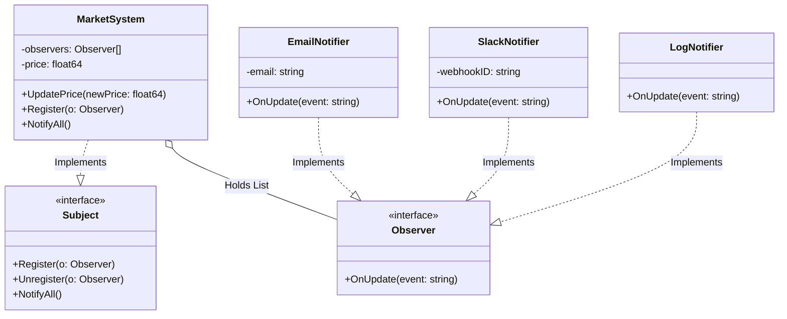

# Go Observer Pattern Example (Clean Architecture)

このプロジェクトは、**Go**言語を用いて**Observer Pattern（オブザーバーパターン）**を実装した教育用のサンプルコードです。状態変化（イベント）を、複数のリスナーに疎結合で通知する仕組みを学びます。

## 📡 シナリオ: 市場価格監視システム

「Bitcoin」などの価格が変動した際、登録されている複数の通知先（Email、Slack、ログ）へ自動的に一斉送信を行います。通知する側（Subject）は、通知される側（Observer）の具体的な実装を知りません。

### 登場人物
1.  **Subject (`usecase.MarketSystem`)**: 監視される対象。価格データと「監視者リスト」を持ちます。
2.  **Observer (`domain.Observer`)**: 通知を受け取るインターフェース。
3.  **Concrete Observer (`adapter.EmailNotifier` etc)**: 具体的な通知手段（Email送信、Slack投稿など）。

## 🏗 アーキテクチャ構成



### 各レイヤーの役割

1.  **Domain (`/domain`)**:
    *   `Observer`: 通知を受け取るためのインターフェース定義。「何かあったら教えて(`OnUpdate`)」という契約のみを定義します。
2.  **Usecase (`/usecase`)**:
    *   `MarketSystem`: 状態（価格）を管理する主体です。
    *   価格が変更される(`UpdatePrice`)と、自分自身で `NotifyAll` を呼び出し、登録されている全てのObserverに連絡します。**誰に連絡するか（EmailかSlackか）は知りません**。
3.  **Adapter (`/adapter`)**:
    *   `EmailNotifier` / `SlackNotifier`: 実際の通知処理です。
    *   Usecaseから呼び出されますが、Usecaseはこの具体的な実装には依存していません（`domain.Observer`経由で呼び出されるため）。

## 💡 アーキテクチャ設計ノート (Q&A)

### Q1. なぜこのパターンが必要なのですか？

**A. 「通知する側」と「通知される側」を切り離す（疎結合にする）ためです。**

もしObserverパターンを使わずに書くと、`usecase` は以下のようになります。

```go
// 悪い例
func (m *MarketSystem) UpdatePrice(price float64) {
    m.price = price
    adapter.SendEmail(...) // 依存！
    adapter.PostSlack(...) // 依存！
    adapter.WriteLog(...)  // 依存！
}
```

これでは、新しい通知先（例: SMS通知）を追加するたびに、**ビジネスロジック（Usecase）を書き換える必要**が出てきます。これは「開放/閉鎖の原則 (OCP)」に違反します。
Observerパターンなら、`main.go` で `Register` するだけで、Usecaseを一切触らずに機能追加できます。

### Q2. GoのChannel（チャネル）とはどう違いますか？

**A. 目的は似ていますが、同期/非同期のアプローチが異なります。**

*   **今回の実装 (Interface)**:
    *   **同期的**です。`NotifyAll` でループして関数を呼ぶため、全ての通知が終わるまで次の処理に進みません。確実に通知したい場合に適しています。
*   **Go Channels**:
    *   **非同期**なイベント処理に向いています。Observer側に `chan string` を持たせて、送信側はチャネルに投げ込むだけ（Fire-and-Forget）といった実装が可能です。
    *   より高度な並行処理が必要な場合はChannelを使いますが、構造的な設計としては今回のインターフェース型が基本となります。

## 🚀 実行方法

```bash
go run main.go
```

### 実行結果の例

```text
=== Observer Pattern Market Demo ===
Setting up listeners...

[Market] Updating price from $30000.00 to $32000.00

--- 📢 Notifying 3 observers ---
📧 [Email to investor@example.com] Received update: Price of 'Bitcoin' changed to $32000.00
💬 [Slack #crypto-alerts] 🚨 Notification: Price of 'Bitcoin' changed to $32000.00
📝 [System Log] Event recorded: Price of 'Bitcoin' changed to $32000.00

Unsubscribing email user...

[Market] Updating price from $32000.00 to $29000.00

--- 📢 Notifying 2 observers ---
💬 [Slack #crypto-alerts] 🚨 Notification: Price of 'Bitcoin' changed to $29000.00
📝 [System Log] Event recorded: Price of 'Bitcoin' changed to $29000.00
```
