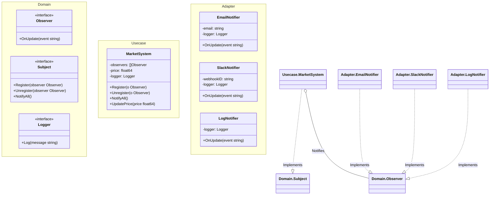

# Go Observer Pattern Example (Clean Architecture)

このプロジェクトは、**Go**言語を用いて**Observer Pattern（オブザーバーパターン）**を実装した教育用のサンプルコードです。あるオブジェクトの状態が変化したときに、それに依存するすべてのオブジェクトに自動的に通知する仕組みを学びます。

## この例で学べること

- **イベント通知**: Subject（市場）の状態変化を、複数のリスナー（Email, Slack, Log）へトリガーする流れ。
- **動的な登録**: リスナーは実行時に購読（Subscribe）したり解除（Unsubscribe）したりできる。
- **インターフェースによる疎結合**: Subject（`MarketSystem`）は `Observer` インターフェースだけを知っており、具体的な実装（`EmailNotifier`など）を知らない。

## 📢 シナリオ：ビットコイン市場トラッカー

ビットコインの価格を追跡する `MarketSystem` があります。
価格が変動したとき、様々なクライアントが通知を欲しがっています。
- **投資家**は **Email** が欲しい。
- **トレーダー**は **Slack** 通知が欲しい。
- **システム**は **ログ** を残したい。

`UpdatePrice` メソッドの中にこれらの処理をハードコードする代わりに、`MarketSystem` はこれらのエンティティを「Observer（観察者）」として登録できるようにします。

## 🏗 アーキテクチャ構成



### 各レイヤーの役割

1. **Domain (`/domain`)**:
    * `Observer`: 更新を受け取るためのインターフェース (`OnUpdate`)。
    * `Subject`: 購読を管理するためのインターフェース。
2. **Usecase (`/usecase`)**:
    * `MarketSystem`: 具体的な Subject。状態（`price`）と購読者リストを保持します。価格が変わるとリストをループして `OnUpdate` を呼び出します。
3. **Adapter (`/adapter`)**:
    * `EmailNotifier`, `SlackNotifier`: 具体的な Observer。`OnUpdate` を実装し、特定のアクション（メール送信、Slack投稿）を行います。

## 💡 アーキテクチャ設計ノート (Q&A)

### Q1. PushモデルとPullモデルの違いは？

**A. この例はPushモデルです。**
Subjectがデータ（`event string`）をObserverに直接渡しています。
**Pullモデル**の場合、Subjectは「変更したよ」とだけ伝え、Observerが `subject.GetPrice()` を呼び出して詳細を取得します。

### Q2. スレッドセーフですか？

**A. デフォルトでは違います。**
もし `UpdatePrice`, `Register`, `Unregister` が別々のゴルーチンから呼ばれる場合は、`observers` スライスの操作を `sync.Mutex` で保護する必要があります。

## 🚀 実行方法

```bash
go run main.go
```