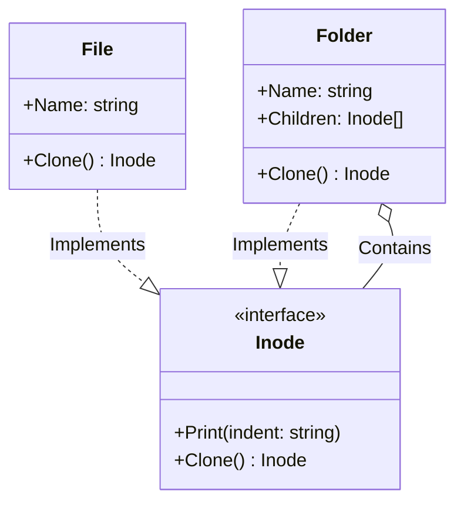

# Go Prototype Pattern Example (Clean Architecture)

This project is an educational sample code that implements the **Prototype Pattern** using the **Go** language. You will learn how to create new instances by "copying (cloning)" an existing instance.

## 📄 Scenario: File System Duplication

In a file system, you might want to copy an entire folder structure (including files and subfolders within it).
This allows you to create a duplicate just by asking an object to "make a copy of yourself," without depending on the class structure (`File` or `Folder`).

### Characters

1. **Prototype (`domain.Inode`)**: A cloneable interface. It has a `Clone()` method.
2. **Concrete Prototype (`adapter.File`, `adapter.Folder`)**: The specific implementation of `Clone()`. A `Folder` needs to recursively clone its child elements as well.

## 🏗 Architecture



### Role of Each Layer

1. **Domain (`/domain`)**:
    * `Inode`: An interface representing a node in the file system (a File or a Folder). It defines the ability to "copy itself."
2. **Adapter (`/adapter`)**:
    * `File`: A simple leaf node. It returns a copy with its name rewritten.
    * `Folder`: A composite structure. When it copies itself, it also `Clone()`s all the `Children` it holds to create a new list (a deep copy).

## 💡 Architectural Design Notes (Q&A)

### Q1. In Go, isn't passing a pointer enough for cloning?

**A. Passing a pointer is "sharing a reference," not "duplication (copying)."**

The purpose of the Prototype pattern is to create a **new, independent object**. If you just pass a pointer, changing the copy will also change the original.
Especially for a struct like `Folder` that has a slice (a reference type), logic for creating a new slice and its contents (Deep Copy) is necessary.

### Q2. When should I use it?

**A. When mass-producing "objects with high initialization costs" or "objects with complex structures."**

If you have a heavy object constructed by reading data from a DB, it's faster to `Clone()` the finished product from memory than to access the DB every time. It's also effective when you want to duplicate a "recursive structure" wholesale, like the file system in this example.

## 🚀 How to Run

```bash
go run main.go
```
