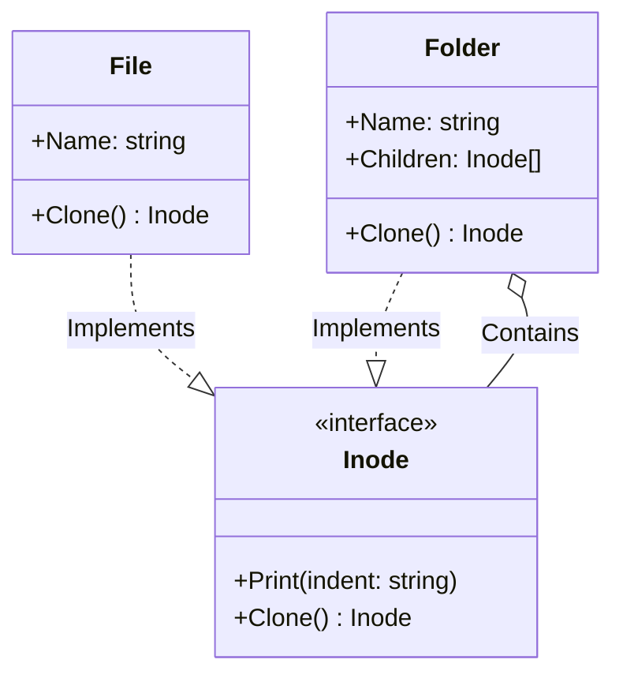

# Go Prototype Pattern Example (Clean Architecture)

このプロジェクトは、**Go**言語を用いて**Prototype Pattern（プロトタイプパターン）**を実装した教育用のサンプルコードです。既存のインスタンスを「コピー（クローン）」して新しいインスタンスを作成する方法を学びます。

## この例で学べること

- コンストラクタではなく `Clone()` により複製を作る考え方
- 再帰構造（フォルダ配下のファイル/フォルダ）をディープコピーする流れ

## すぐ試す

`prototype-example` ディレクトリで実行します。

```bash
go run main.go
```

## 📄 シナリオ: ファイルシステムの複製

ファイルシステムにおいて、フォルダ構造（内部にファイルやサブフォルダを含む）を丸ごとコピーしたい場合があります。
クラス構造（`File`や`Folder`）に依存せずに、「自分自身のコピーを作って」と依頼するだけで複製できるようにします。

### 登場人物
1.  **Prototype (`domain.Inode`)**: クローン可能なインターフェース。`Clone()` メソッドを持ちます。
2.  **Concrete Prototype (`adapter.File`, `adapter.Folder`)**: `Clone()` の具体的な実装。`Folder` は再帰的に子要素もクローンする必要があります。

## 🏗 アーキテクチャ構成



### 各レイヤーの役割

1.  **Domain (`/domain`)**:
    *   `Inode`: ファイルシステムのノード（FileまたはFolder）を表すインターフェース。「自分自身をコピーできる」という能力を定義します。
2.  **Adapter (`/adapter`)**:
    *   `File`: 単純な末端ノード。名前を書き換えてコピーを返します。
    *   `Folder`: コンポジット構造。自身をコピーする際、保持している `Children` もすべて `Clone()` して新しいリストを作ります（ディープコピー）。

## 💡 アーキテクチャ設計ノート (Q&A)

### Q1. Goでのクローンはポインタ渡しではダメなのですか？

**A. ポインタ渡しは「参照の共有」であり、「複製（コピー）」ではありません。**

プロトタイプパターンの目的は、**独立した新しいオブジェクト**を作ることです。ポインタを渡すだけだと、コピー先を変更したときにコピー元まで変わってしまいます。
特に `Folder` のようにスライス（参照型）を持つ構造体の場合、スライスの中身まで新しく作り直す（Deep Copy）ロジックが必要になります。

### Q2. いつ使いますか？

**A. 「初期化コストが高いオブジェクト」や「複雑な構造を持つオブジェクト」を量産するときです。**

DBからデータを読み込んで構築した重いオブジェクトがある場合、毎回DBアクセスするより、メモリ上の完成品を `Clone()` する方が高速です。また、今回のファイルシステムのように「再帰的な構造」をまるごと複製したい場合にも有効です。

## 🚀 実行方法

```bash
go run main.go
```
