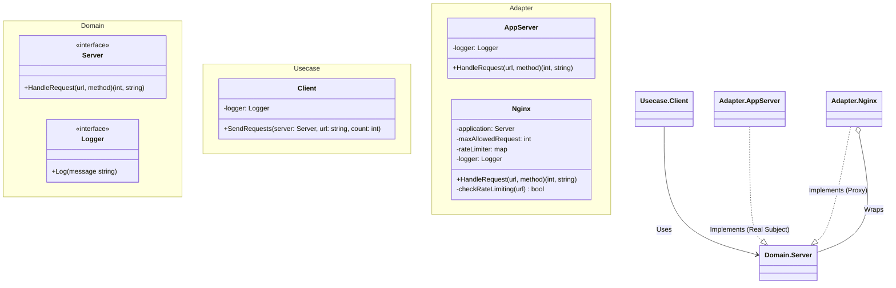

# Go Proxy Pattern Example (Clean Architecture)

This project is an educational sample code that implements the **Proxy Pattern** using the **Go** language. It demonstrates how to control access to an object by placing a proxy (substitute) in front of it.

## What This Example Shows

- **Access Control**: The Proxy (`Nginx`) checks rate limits before forwarding the request to the real subject (`AppServer`).
- **Transparent Usage**: The client (`main.go` / `Client`) treats the Proxy and the Real Subject exactly the same via the `Server` interface.
- **Dependency Injection**: The Real Subject is injected into the Proxy.

## 🚦 Scenario: Nginx as a Reverse Proxy

You have an Application Server (`AppServer`) that handles API requests.
However, to prevent overload, you want to limit the number of requests per URL.
Instead of adding rate limiting logic inside the AppServer, you place an **Nginx** proxy in front of it to intercept and check requests first.

## 🏗 Architecture



### Role of Each Layer

1. **Domain (`/domain`)**:
    * `Server`: The common interface for both the Proxy and the Real Subject.
2. **Usecase (`/usecase`)**:
    * `Client`: Sends requests to a `Server`. It doesn't know if it's talking to Nginx or the App directly.
3. **Adapter (`/adapter`)**:
    * `AppServer` (Real Subject): The actual logic handler.
    * `Nginx` (Proxy): Wraps the `AppServer`. It adds "Rate Limiting" logic. If allowed, it delegates to `AppServer`.

## 💡 Architectural Design Notes (Q&A)

### Q1. What are other use cases for Proxy?

**A. There are several types:**
*   **Protection Proxy**: Controls access (Auth, Rate Limiting) - *This example*.
*   **Virtual Proxy**: Delays creation of expensive objects until needed.
*   **Remote Proxy**: Represents an object in a different address space (RPC).
*   **Caching Proxy**: Returns cached results instead of executing the target.

### Q2. How is this different from Decorator?

**A. The intent is different.**
*   **Decorator**: Adds *behavior* or responsibilities (e.g., adding UI borders, adding logging). Can be wrapped multiple times.
*   **Proxy**: Controls *access* to the object. Usually manages the lifecycle or access rights of the Real Subject.

## 🚀 How to Run

```bash
go run main.go
```