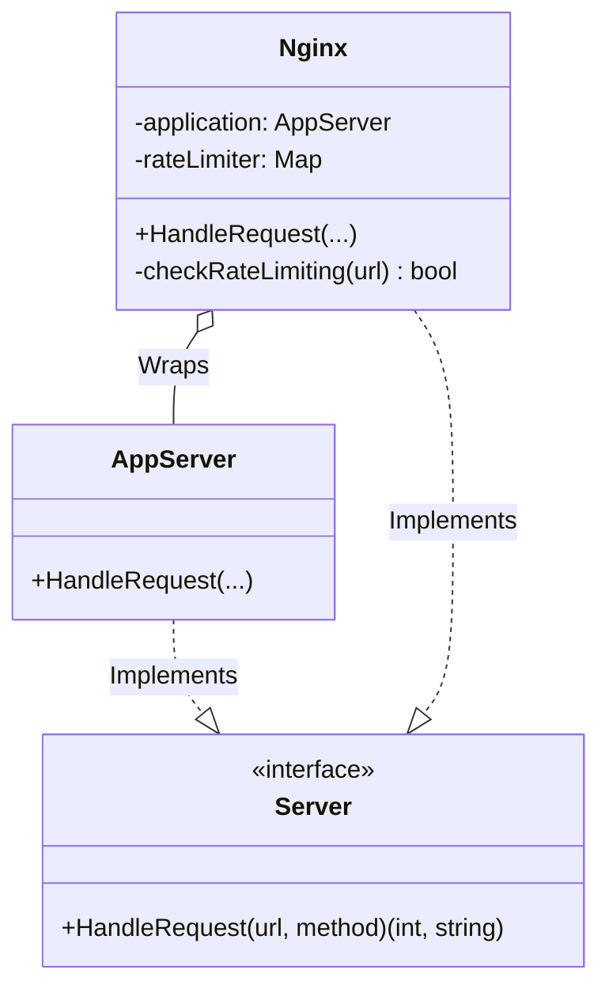

# Go Proxy Pattern Example (Clean Architecture)

This project is an educational sample code that implements the **Proxy Pattern** using the **Go** language. You will learn how to place a "proxy" to control access to an object.

## What This Example Shows

- Using a proxy (`Nginx`) to control access to a real server
- Adding rate limiting without changing the application server

## Quick Start

In the `proxy-example` directory:

```bash
go run main.go
```

## 🛡 Scenario: Rate Limiting with Nginx

When sending requests to a web server (Application), instead of accessing it directly, we go through Nginx (a web server and reverse proxy).
If there are too many requests to a specific URL, Nginx returns a "403 Forbidden" response without passing the request to the actual application server.
This protects the application server from overload.

### Characters

1. **Subject (`domain.Server`)**: The common interface, which has a `HandleRequest` method.
2. **Real Subject (`adapter.AppServer`)**: The server that performs the actual processing. It does not contain logic for access control (Single Responsibility Principle).
3. **Proxy (`adapter.Nginx`)**: The agent. It holds a reference to the `RealSubject`. When a request comes in, it performs a check (rate limiting) and, if there are no issues, delegates the processing to the `RealSubject`.

## 🏗 Architecture



### Role of Each Layer

1. **Domain (`/domain`)**:
    * `Server`: The interface for behaving as a server.
2. **Adapter (`/adapter`)**:
    * `AppServer`: The core logic (API processing, etc.). This is where business logic should be concentrated.
    * `Nginx`: Handles "pre-processing and post-processing" tasks like security and caching.

## 💡 Architectural Design Notes (Q&A)

### Q1. What types of proxies are there?

**A. The name changes depending on the use case.**

* **Protection Proxy**: Checks access permissions (this example).
* **Virtual Proxy**: Delays the creation of heavy objects (like large images) until they are actually needed (Lazy Initialization).
* **Remote Proxy**: Makes an object on the network appear as if it were local (e.g., gRPC stubs).
* **Cache Proxy**: Caches results to skip the real processing.

### Q2. Isn't this the same as the Decorator pattern?

**A. The structure is almost the same, but the purpose (Intent) is different.**

* **Decorator**: The purpose is to "add" functionality (behavior).
* **Proxy**: The purpose is to "control" access.
  * A Proxy often manages the creation lifecycle of the RealSubject or denies access altogether.

## 🚀 How to Run

```bash
go run main.go
```
