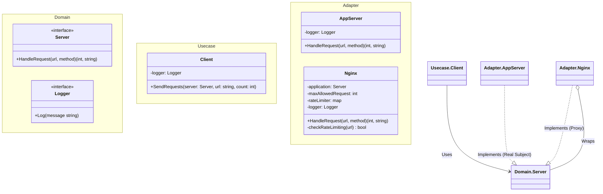

# Go Proxy Pattern Example (Clean Architecture)

このプロジェクトは、**Go**言語を用いて**Proxy Pattern（プロキシパターン）**を実装した教育用のサンプルコードです。オブジェクトの前に代理（プロキシ）を置くことで、そのオブジェクトへのアクセスを制御する方法を学びます。

## この例で学べること

- **アクセス制御**: プロキシ（`Nginx`）がリクエストを本物のサーバー（`AppServer`）に転送する前に、レート制限（回数制限）をチェックします。
- **透過的な利用**: クライアントは、相手がプロキシなのか本物なのかを意識せずに、同じ `Server` インターフェースを通して利用します。
- **依存性注入**: 本物のサーバーをプロキシに注入する構成をとっています。

## 🚦 シナリオ：リバースプロキシとしてのNginx

APIリクエストを処理するアプリケーションサーバー（`AppServer`）があります。
しかし、過負荷を防ぐために、URLごとのリクエスト数を制限したいと考えています。
`AppServer` の中に制限ロジックを書く代わりに、手前に **Nginx** プロキシを置いて、そこでリクエストを検査・遮断します。

## 🏗 アーキテクチャ構成



### 各レイヤーの役割

1. **Domain (`/domain`)**:
    * `Server`: プロキシと本物のサーバーが共通して実装するインターフェース。
2. **Usecase (`/usecase`)**:
    * `Client`: リクエストを送信するクライアント。相手がNginxかアプリかを意識しません。
3. **Adapter (`/adapter`)**:
    * `AppServer` (Real Subject): 実際のビジネスロジックを実行するサーバー。
    * `Nginx` (Proxy): `AppServer` をラップします。「レート制限」のロジックを追加し、許可された場合のみ `AppServer` に処理を委譲します。

## 💡 アーキテクチャ設計ノート (Q&A)

### Q1. Proxyパターンの他の用途は？

**A. いくつかの種類があります。**
*   **Protection Proxy (保護プロキシ)**: アクセス権限を管理する（認証、レート制限など） - *今回の例*。
*   **Virtual Proxy (仮想プロキシ)**: 生成コストの高いオブジェクトの作成を、本当に必要になるまで遅延させる。
*   **Remote Proxy (リモートプロキシ)**: 別のネットワーク上に存在するオブジェクトを、あたかも手元にあるかのように扱う。
*   **Caching Proxy (キャッシュプロキシ)**: 処理を実行せずにキャッシュされた結果を返す。

### Q2. Decoratorパターンとの違いは？

**A. 「意図」が異なります。**
*   **Decorator**: オブジェクトに「機能」や「責任」を追加する（装飾する）。多重にラップすることが多い。
*   **Proxy**: オブジェクトへの「アクセス」を制御する。本人の代わりとして振る舞うことに主眼がある。

## 🚀 実行方法

```bash
go run main.go
```