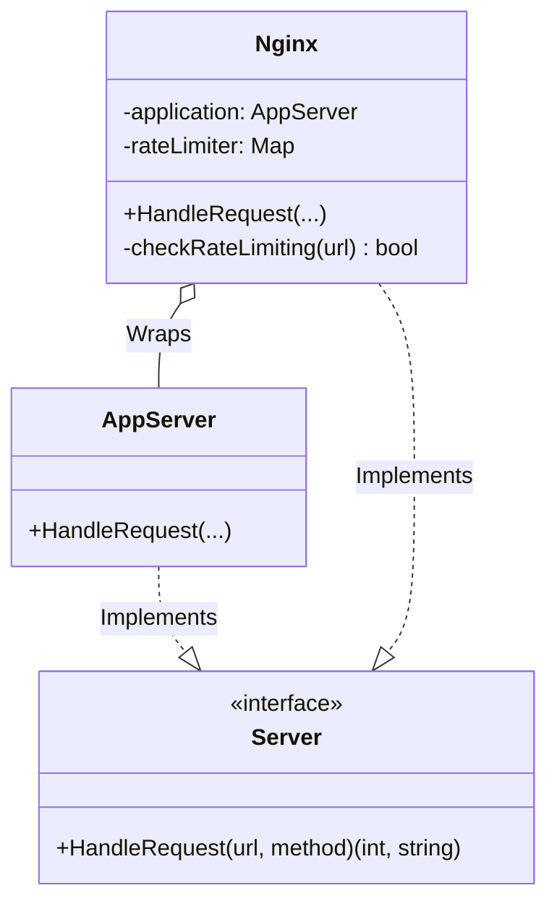

# Go Proxy Pattern Example (Clean Architecture)

このプロジェクトは、**Go**言語を用いて**Proxy Pattern（プロキシパターン）**を実装した教育用のサンプルコードです。あるオブジェクトへのアクセスを制御するための「代理人（Proxy）」を配置する方法を学びます。

## この例で学べること

- Proxy（`Nginx`）が実サーバの前に立ち、アクセス制御を行う設計
- 透過的にレートリミットを追加できること

## すぐ試す

`proxy-example` ディレクトリで実行します。

```bash
go run main.go
```

## 🛡 シナリオ: Nginxによるレート制限 (Rate Limiting)

Webサーバー（Application）にリクエストを送る際、直接アクセスさせるのではなく、Nginx（Webサーバー兼リバースプロキシ）を経由させます。
Nginxは、特定のURLへのアクセス回数が多すぎる場合、本物のアプリケーションサーバーにリクエストを渡さずに「403 Forbidden」を返します。
これにより、アプリケーションサーバーを過負荷から守ることができます。

### 登場人物
1.  **Subject (`domain.Server`)**: 共通インターフェース。`HandleRequest` を持ちます。
2.  **Real Subject (`adapter.AppServer`)**: 本当の処理を行うサーバー。アクセス制限のロジックなどは持ちません（単一責任の原則）。
3.  **Proxy (`adapter.Nginx`)**: 代理人。`RealSubject` への参照を持ちます。リクエストが来たら、チェック（レート制限）を行い、問題なければ `RealSubject` に処理を委譲します。

## 🏗 アーキテクチャ構成



### 各レイヤーの役割

1.  **Domain (`/domain`)**:
    *   `Server`: サーバーとして振る舞うためのインターフェース。
2.  **Adapter (`/adapter`)**:
    *   `AppServer`: コアロジック（API処理など）。ここはビジネスロジックに集中すべき場所です。
    *   `Nginx`: セキュリティやキャッシュなどの「前処理・後処理」を担当します。

## 💡 アーキテクチャ設計ノート (Q&A)

### Q1. どのような種類がありますか？

**A. 用途によって呼び名が変わります。**

*   **保護プロキシ (Protection Proxy)**: アクセス権限をチェックする（今回の例）。
*   **仮想プロキシ (Virtual Proxy)**: 重いオブジェクト（巨大画像など）の生成を、本当に必要になるまで遅らせる（Lazy Initialization）。
*   **リモートプロキシ (Remote Proxy)**: ネットワーク越しにあるオブジェクトを、あたかも手元にあるかのように見せる（gRPCスタブなど）。
*   **キャッシュプロキシ**: 結果をキャッシュして、本物の処理をスキップする。

### Q2. Decoratorパターンと同じではないですか？

**A. 構造はほぼ同じですが、目的（Intent）が異なります。**

*   **Decorator**: 機能（振る舞い）を「追加」することが目的。
*   **Proxy**: アクセスを「制御」することが目的。
    *   Proxyは、RealSubjectの生成ライフサイクルを管理したり、アクセス自体を拒否したりすることがよくあります。

## 🚀 実行方法

```bash
go run main.go
```
