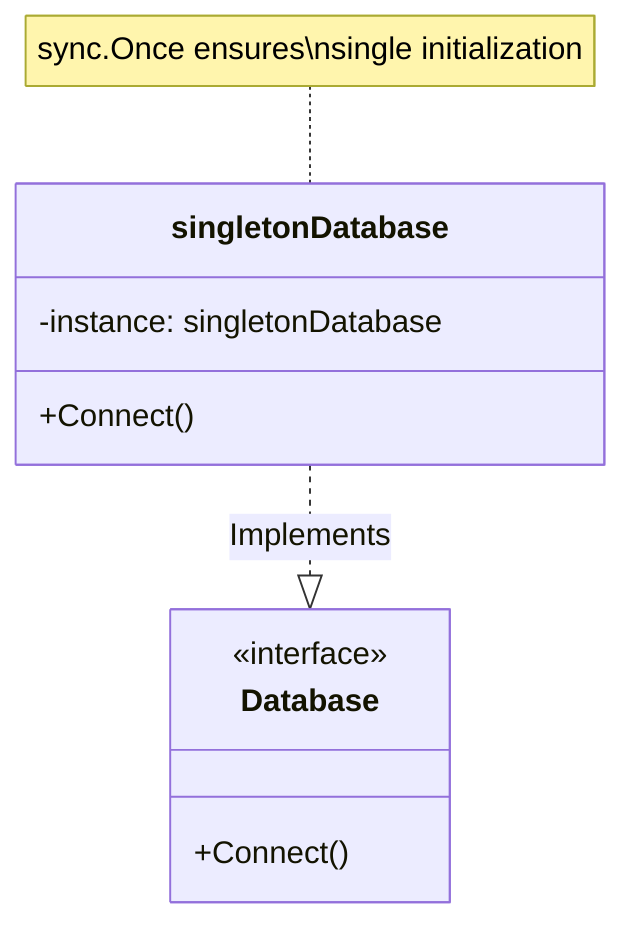

# Go Singleton Pattern Example (Clean Architecture)

This project is an educational sample code that implements the **Singleton Pattern** using the **Go** language. You will learn how to ensure that there is "only one instance" of a class throughout the application.

## What This Example Shows

- Ensuring only one database instance exists via `sync.Once`
- Providing a global access point without repeated initialization

## Quick Start

In the `singleton-example` directory:

```bash
go run main.go
```

## 🗄 Scenario: Database Connection Instance

Creating numerous database connection objects within an application can lead to resource exhaustion (e.g., number of connections).
We will control it so that a "single DB connection instance" is shared across the entire system.

### Characters

1. **Singleton (`adapter.singletonDatabase`)**: The concrete struct. It is hidden to prevent direct instantiation from outside (by starting with a lowercase letter in Go).
2. **Accessor (`adapter.GetDatabaseInstance`)**: A global function to get the single instance.
3. **Interface (`domain.Database`)**: The abstract type that clients depend on.

## 🏗 Architecture



### Role of Each Layer

1. **Domain (`/domain`)**:
    * `Database`: The interface for DB operations. Clients use this.
2. **Adapter (`/adapter`)**:
    * `singletonDatabase`: The implementation details. It is a private struct.
    * `GetDatabaseInstance()`: The access point to the instance. Internally, it uses Go's `sync.Once` to perform initialization **thread-safely** only once.

## 💡 Architectural Design Notes (Q&A)

### Q1. What's the difference from a global variable?

**A. The difference lies in "initialization control" and "lazy initialization."**

A simple global variable is initialized unconditionally when the program starts and is at risk of being overwritten at unintended times.
The Singleton pattern (especially an implementation using `sync.Once`) ensures that it is safely initialized **"the moment it is first needed"** and is not changed thereafter.

### Q2. What are the considerations for Singletons in Go?

**A. There are two main approaches: using the `init()` function and using `sync.Once`.**

* `init()`: Initialization occurs when the package is loaded. It's simple, but the initialization cost is incurred even if it's not used.
* `sync.Once`: Execution happens when it's first called (Lazy Initialization). Since it operates safely in a concurrent environment, **this is the recommended approach in Go**. This sample also uses `sync.Once`.

## 🚀 How to Run

```bash
go run main.go
```

### Example Output

```text
=== Singleton Pattern ===
Call 1: Creating single database instance now.
Connected to the database instance.
Call 2: Connected to the database instance.
Call 3: Connected to the database instance.
```

You can confirm that "Creating..." is displayed only on the first call.
