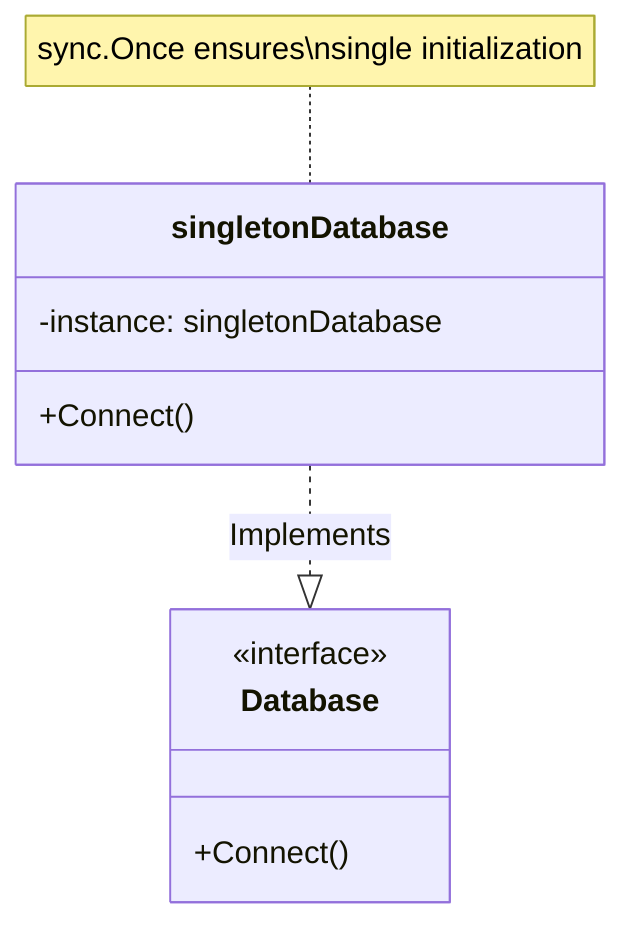

# Go Singleton Pattern Example (Clean Architecture)

このプロジェクトは、**Go**言語を用いて**Singleton Pattern（シングルトンパターン）**を実装した教育用のサンプルコードです。アプリケーション全体で「インスタンスが一つだけであること」を保証する方法を学びます。

## 🗄 シナリオ: データベース接続インスタンス

データベースへの接続オブジェクトは、アプリケーション内で無数に作るとリソース（コネクション数など）を枯渇させる原因になります。
システム全体で「唯一のDB接続インスタンス」を共有するように制御します。

### 登場人物
1.  **Singleton (`adapter.singletonDatabase`)**: 具体的な構造体。外部からは直接生成できないように（Goでは小文字始まりにして）隠蔽します。
2.  **Accessor (`adapter.GetDatabaseInstance`)**: 唯一のインスタンスを取得するためのグローバルな関数。
3.  **Interface (`domain.Database`)**: クライアントが依存する抽象型。

## 🏗 アーキテクチャ構成



### 各レイヤーの役割

1.  **Domain (`/domain`)**:
    *   `Database`: DB操作のインターフェース。クライアントはこれを使います。
2.  **Adapter (`/adapter`)**:
    *   `singletonDatabase`: 実装の詳細。非公開（private）な構造体です。
    *   `GetDatabaseInstance()`: インスタンスへのアクセスポイント。内部でGoの `sync.Once` を使い、**スレッドセーフに**一度だけ初期化を行います。

## 💡 アーキテクチャ設計ノート (Q&A)

### Q1. グローバル変数と何が違うのですか？

**A. 「初期化の制御」と「遅延初期化」ができる点が異なります。**

単なるグローバル変数は、プログラム開始時に問答無用で初期化されたり、意図しないタイミングで書き換えられるリスクがあります。
Singletonパターン（特に `sync.Once` を使った実装）は、**「最初に必要になった瞬間」**に安全に初期化され、その後は変更されないことを保証できます。

### Q2. GoでのSingletonの注意点は？

**A. `init()` 関数を使う方法と `sync.Once` を使う方法があります。**

*   `init()`: パッケージ読み込み時に初期化されます。シンプルですが、使わない場合でも初期化コストがかかります。
*   `sync.Once`: 最初に呼び出されたときに実行されます（Lazy Initialization）。並行処理環境でも安全に動作するため、**Goではこちらが推奨されます**。このサンプルでも `sync.Once` を採用しています。

## 🚀 実行方法

```bash
go run main.go
```

### 実行結果の例

```text
=== Singleton Pattern ===
Call 1: Creating single database instance now.
Connected to the database instance.
Call 2: Connected to the database instance.
Call 3: Connected to the database instance.
```

"Creating..." が最初の1回しか表示されないことが確認できます。