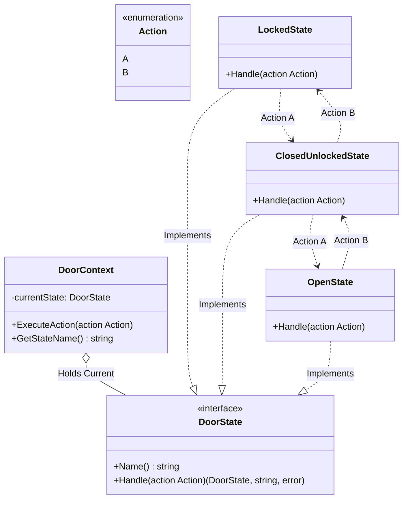

# Go State Pattern Example (Clean Architecture)

This project is an educational sample code that implements the **State Pattern** using the **Go** language. Following the structure of Clean Architecture, it separates the logic of state transitions.

## What This Example Shows

- Encapsulating state‑specific behavior in separate state objects
- Delegating transitions from the context to the current state

## Quick Start

In the `state-example` directory:

```bash
go run main.go
```

## 🚪 Scenario: Door Opening and Closing System

A door has three states, and its state transitions through two actions (A and B).

### States

1. **Locked**: The door is locked.
2. **ClosedUnlocked**: The door is closed but unlocked.
3. **Open**: The door is open.

### Actions

* **Action A**:
  * When Locked → **Unlock**
  * When ClosedUnlocked → **Open**
  * When Open → Do nothing
* **Action B**:
  * When Open → **Close**
  * When ClosedUnlocked → **Lock**
  * When Locked → Do nothing

## 🏗 Architecture



### Role of Each Layer

1. **Domain (`/domain`)**:
    * `DoorState` interface: Defines the behavior that all states must have (`Handle`).
    * `Action` constant: The common language used within the system.
2. **Usecase (`/usecase`)**:
    * **Context**: A container that holds the current state (`currentState`).
    * When it receives user input, it doesn't make decisions itself but delegates the task to the current state (`currentState.Handle`).
3. **Adapter (`/adapter`)**:
    * **Concrete States**: A place for the specific logic of each state, such as `LockedState` and `OpenState`.
    * The **transition rules**, like "when in the Locked state and button A is pressed, the next state is ClosedUnlocked," are described here.

## 💡 Architectural Design Notes (Q&A)

For engineers learning Clean Architecture, this section explains the important intentions behind this design.

### Q1. Where should the state transition rules (if/switch statements) be written?

**A. In the State Pattern, they are written inside each "State class (Adapter)."**

If you write a giant `switch` statement (`if state == Locked then ...`) in the `Usecase`, you would need to modify that huge function every time a new state is added, making it a breeding ground for bugs.
In the State Pattern, the "behavior in the Locked state" is encapsulated within the `LockedState` class. This makes the code for each state independent and easier to understand.

### Q2. How well does it fit with Clean Architecture?

**A. It fits very well.**

* **Domain**: Defines the state interface.
* **Adapter**: Implements the concrete state transition logic.
* **Usecase**: Simply holds and uses the state.

This clean separation of responsibilities makes it a very effective design for creating applications with complex state machines (like games, workflow engines, payment flows, etc.).

## 🚀 How to Run

```bash
go run main.go
```

### Example Output

```text
=== Door State Machine System Started ===
Initial State: LOCKED 🔒

[Input B] (Current: LOCKED 🔒          ) -> Door is already locked. -> New State: LOCKED 🔒
[Input A] (Current: LOCKED 🔒          ) -> Unlocking door... -> New State: CLOSED (UNLOCKED) 🚪
[Input A] (Current: CLOSED (UNLOCKED) 🚪) -> Opening door... -> New State: OPEN 💨
[Input A] (Current: OPEN 💨            ) -> Door is already open. -> New State: OPEN 💨
[Input B] (Current: OPEN 💨            ) -> Closing door... -> New State: CLOSED (UNLOCKED) 🚪
[Input B] (Current: CLOSED (UNLOCKED) 🚪) -> Locking door... -> New State: LOCKED 🔒
```
