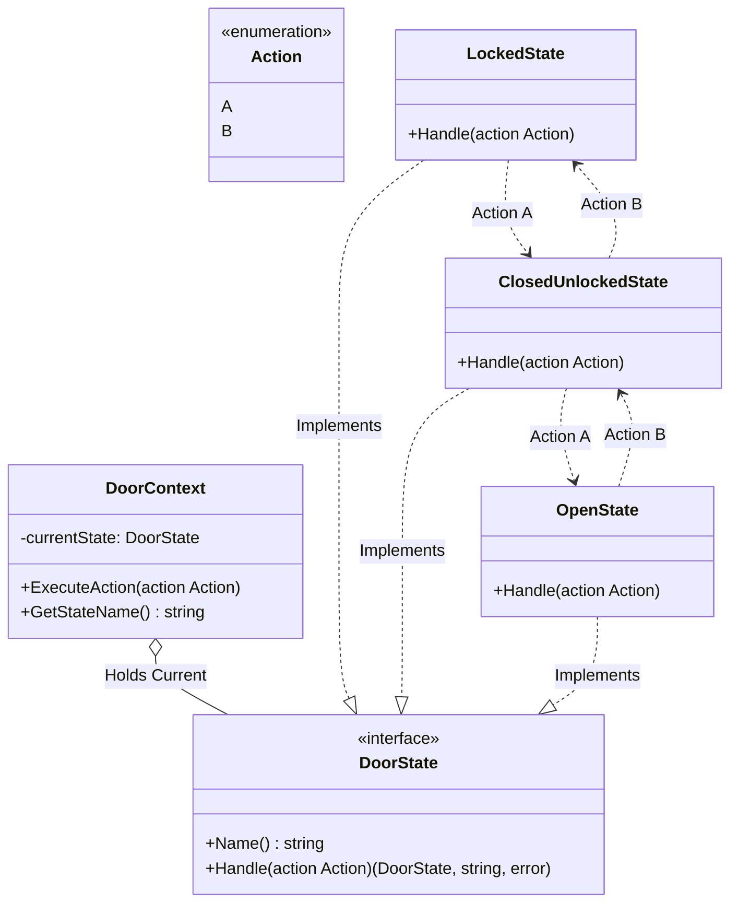

# Go State Pattern Example (Clean Architecture)

このプロジェクトは、**Go**言語を用いて**State Pattern（ステートパターン）**を実装した教育用のサンプルコードです。Clean Architectureの構成に倣い、状態遷移のロジックを分離しています。

## 🚪 シナリオ: ドアの開閉システム

ドアには3つの状態があり、2つのアクション（AとB）によって状態が遷移します。

### 状態 (State)
1.  **Locked (施錠中)**: カギがかかっている状態。
2.  **ClosedUnlocked (閉扉・解錠)**: ドアは閉まっているが、カギは開いている状態。
3.  **Open (開扉)**: ドアが開いている状態。

### アクション (Action)
*   **Action A**:
    *   Lockedの時 → **Unlock** (解錠する)
    *   ClosedUnlockedの時 → **Open** (開ける)
    *   Openの時 → 何もしない
*   **Action B**:
    *   Openの時 → **Close** (閉める)
    *   ClosedUnlockedの時 → **Lock** (施錠する)
    *   Lockedの時 → 何もしない

## 🏗 アーキテクチャ構成



### 各レイヤーの役割

1.  **Domain (`/domain`)**:
    *   `DoorState` インターフェース：全ての状態が持つべき振る舞い（`Handle`）を定義。
    *   `Action` 定数：システム内で使われる共通言語。
2.  **Usecase (`/usecase`)**:
    *   **Context**: 現在の状態(`currentState`)を保持する箱です。
    *   ユーザーからの入力を受け取ると、自分で判断せず、今の状態(`currentState.Handle`)に「これやって」と丸投げ（委譲）します。
3.  **Adapter (`/adapter`)**:
    *   **Concrete States**: `LockedState` や `OpenState` など、各状態ごとの具体的なロジック置き場です。
    *   「Lockedの時にボタンAを押されたら、次はClosedUnlockedになる」といった**遷移ルール**はここに記述されます。

## 💡 アーキテクチャ設計ノート (Q&A)

Clean Architectureを学ぶエンジニア向けに、この設計の背後にある重要な意図を解説します。

### Q1. 状態遷移のルール（if/switch文）はどこに書くべきですか？

**A. State Patternでは、各「Stateクラス（Adapter）」の中に書きます。**

もし `Usecase` に巨大な `switch` 文（`if state == Locked then ...`）を書いてしまうと、状態が増えるたびにその巨大な関数を修正する必要があり、バグの温床になります。
State Patternでは、「Locked状態の時の振る舞い」は `LockedState` クラスの中に閉じ込めます。これにより、各状態のコードが独立し、見通しが良くなります。

### Q2. Clean Architectureとの相性はどうですか？

**A. 非常に良いです。**

*   **Domain**: 状態のインターフェースを定義。
*   **Adapter**: 具体的な状態遷移ロジックを実装。
*   **Usecase**: 状態を保持して使うだけ。

このように責務が綺麗に分かれるため、複雑なステートマシンを持つアプリケーション（ゲーム、ワークフローエンジン、決済フローなど）を作成する場合に非常に有効な設計となります。

## 🚀 実行方法

```bash
go run main.go
```

### 実行結果の例

```text
=== Door State Machine System Started ===
Initial State: LOCKED 🔒

[Input B] (Current: LOCKED 🔒          ) -> Door is already locked. -> New State: LOCKED 🔒
[Input A] (Current: LOCKED 🔒          ) -> Unlocking door... -> New State: CLOSED (UNLOCKED) 🚪
[Input A] (Current: CLOSED (UNLOCKED) 🚪) -> Opening door... -> New State: OPEN 💨
[Input A] (Current: OPEN 💨            ) -> Door is already open. -> New State: OPEN 💨
[Input B] (Current: OPEN 💨            ) -> Closing door... -> New State: CLOSED (UNLOCKED) 🚪
[Input B] (Current: CLOSED (UNLOCKED) 🚪) -> Locking door... -> New State: LOCKED 🔒
```