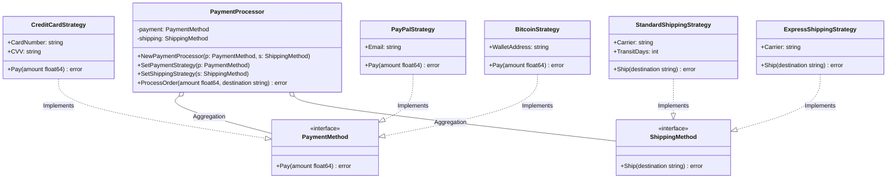

# Go Strategy Pattern Example (Clean Architecture)

This project is an educational sample code that implements the **Strategy Pattern** using the **Go** language. The design incorporates the principles of **Clean Architecture** to clearly separate dependencies.

## What This Example Shows

- Swapping payment and shipping behaviors at runtime by injecting different strategies
- Keeping the **“how”** (concrete payment/shipping methods) inside `adapter`, while the `usecase` keeps the **“when/what”** (order flow and validation) independent of concretes
- Choosing which strategy to use happens in `main.go` (composition root), not in `usecase`

## Quick Start

In the `strategy-example` directory:

```bash
go run main.go
```

## 🏗 Architecture



### Role of Each Layer

1. **Domain (`/domain`)**:
    * This is the **core of the business rules**.
    * It only defines the `PaymentMethod`/`ShippingMethod` interfaces, exposing only the contract for "pay" and "ship" behaviors. It does not know who or how it will be executed.
2. **Usecase (`/usecase`)**:
    * This is the **application's conductor (Context)**.
    * `PaymentProcessor` depends on `PaymentMethod` and `ShippingMethod` and does not know the concrete implementations of payment and shipping. This allows strategies (payment/shipping) to be swapped without changing the business logic.
3. **Adapter (`/adapter`)**:
    * This is the **concrete implementation (Strategy)**.
    * It corresponds to the "Interface Adapters" in Clean Architecture.
    * Concrete classes like `CreditCardStrategy` and `StandardShippingStrategy` are placed here and implemented to satisfy the contracts of the Domain layer.

## 💡 Architectural Design Notes (Q&A)

For engineers learning Clean Architecture, this section explains the important intentions behind this design.

### Q1. Why shouldn't the `usecase` use concrete `CreditCardStrategy` or `StandardShippingStrategy`?

**A. To adhere to the "Dependency Inversion Principle (DIP)" and the "Open/Closed Principle (OCP)."**

If the `usecase` directly depends on concrete implementations, the following problems arise:

1. **Fragile to Change**: When you want to add PayPal or Express shipping, you have to rewrite the `usecase` code.
2. **Difficult to Test**: There's a risk of running real payment/shipping processes during testing, making it difficult to swap in mocks (fakes).

By depending on interfaces (`PaymentMethod`, `ShippingMethod`), you can change the behavior by simply changing the strategy injected in `main.go`, without any modifications to the `usecase`.

### Q2. How do I add a new payment or shipping method?

**A. Follow these steps. No modification to existing code is necessary.**

1. Create a struct like `ApplePayStrategy` or `B2CExpressStrategy` in the `adapter` package.
2. Implement the `Pay` or `Ship` method (to satisfy `PaymentMethod` / `ShippingMethod` respectively).
3. In `main.go`, create the new strategy and inject it with `processor.SetPaymentStrategy()` or `processor.SetShippingStrategy()`.

The real power of the Strategy Pattern is the ability to simply swap complex combinations of payment and shipping by switching strategies. You don't need to touch a single line of the existing `PaymentProcessor` or other strategy code.

## 🚀 How to Run

In the strategy-example directory, run the following command:

```bash
go run main.go
```

### Example Output

```text
Scenario 1: Customer pays with Credit Card
--- Starting Payment Process ---
Paying $100.50 using Credit Card (Last 4: 5678)
--- Payment Successful ---
--- Preparing Shipment ---
Scheduling standard Japan Post shipping to Tokyo (ETA: 5 days)
--- Shipment Scheduled ---

Scenario 2: Customer switches to PayPal
--- Starting Payment Process ---
Paying $50.00 using PayPal (Account: user@example.com)
--- Payment Successful ---
--- Preparing Shipment ---
Scheduling express DHL Express shipping to Osaka (Next day delivery)
--- Shipment Scheduled ---

Scenario 3: Customer uses Crypto
--- Starting Payment Process ---
Paying $0.05 using Bitcoin (Wallet: 1A1zP1eP5QGefi2DMPTfTL5SLmv7DivfNa)
--- Payment Successful ---
--- Preparing Shipment ---
Scheduling standard Japan Post shipping to Kyoto (ETA: 5 days)
--- Shipment Scheduled ---

```
