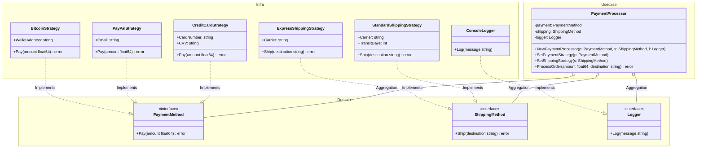

# Go Strategy Pattern Example (Clean Architecture)

This project is an educational sample code that implements the **Strategy Pattern** using the **Go** language. The design incorporates the principles of **Clean Architecture** to clearly separate dependencies.

## What This Example Shows

- Swapping payment and shipping behaviors at runtime by injecting different strategies
- Keeping the **“how”** (concrete payment/shipping methods) inside `adapter`, while the `usecase` keeps the **“when/what”** (order flow and validation) independent of concretes
- Abstracting side effects (logging) using interfaces to maintain pure business logic
- Choosing which strategy to use happens in `main.go` (composition root), not in `usecase`

## Quick Start

In the `strategy-example` directory:

```bash
go run main.go
```

## 🏗 Architecture



### Role of Each Layer

1. **Domain (`/domain`)**:
    * This is the **core of the business rules**.
    * It only defines interfaces (`PaymentMethod`, `ShippingMethod`, `Logger`), exposing only the contracts for behaviors. It does not know who or how they will be executed.
2. **Usecase (`/usecase`)**:
    * This is the **application's conductor (Context)**.
    * `PaymentProcessor` depends on the Domain interfaces and does not know the concrete implementations. This allows strategies to be swapped without changing business logic and makes testing easier by allowing mock injections.
3. **Adapter (`/adapter`)**:
    * This is the **concrete implementation (Strategy)**.
    * It corresponds to the "Interface Adapters" in Clean Architecture.
    * Concrete classes like `CreditCardStrategy`, `StandardShippingStrategy`, and `ConsoleLogger` are placed here.

## 💡 Architectural Design Notes (Q&A)

For engineers learning Clean Architecture, this section explains the important intentions behind this design.

### Q1. Why shouldn't the `usecase` use concrete strategies directly?

**A. To adhere to the "Dependency Inversion Principle (DIP)" and the "Open/Closed Principle (OCP)."**

If the `usecase` directly depends on concrete implementations, the following problems arise:

1. **Fragile to Change**: Adding new methods requires rewriting the `usecase` code.
2. **Difficult to Test**: You cannot easily mock dependencies, leading to side effects (e.g., real payments or console output) during tests.

By depending on interfaces, you can change the behavior by simply injecting different implementations in `main.go`.

### Q2. How do I add a new payment or shipping method?

**A. Follow these steps. No modification to existing code is necessary.**

1. Create a struct in the `adapter` package.
2. Implement the required interface methods.
3. In `main.go`, create the new strategy and inject it.

The real power of the Strategy Pattern is the ability to simply swap complex combinations of payment and shipping by switching strategies.

## 🚀 How to Run

In the strategy-example directory, run the following command:

```bash
go run main.go
```
