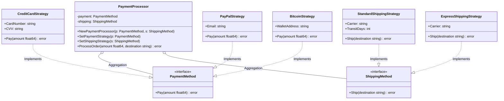

# Go Strategy Pattern Example (Clean Architecture)

このプロジェクトは、**Go**言語を用いて**Strategy Pattern（ストラテジーパターン）**を実装した教育用のサンプルコードです。設計には**Clean Architecture**の原則を取り入れ、依存関係の分離を明確にしています。

## この例で学べること

- 決済・配送の振る舞いをストラテジーとして差し替え、実行時に切り替える流れ
- **「どう支払う/どう配送するか（How）」**は `adapter` に閉じ、`usecase` は **「いつ/何をするか（When/What）」**の業務フローと検証だけを持つ設計
- どのストラテジーを使うかの選択は `main.go`（依存性注入の組み立て場所）で行う

## すぐ試す

`strategy-example` ディレクトリで実行します。

```bash
go run main.go
```

## 🏗 アーキテクチャ構成



### 各レイヤーの役割

1. **Domain (`/domain`)**:
    * **ビジネスルールの核心**です。
    * `PaymentMethod`/`ShippingMethod` のインターフェースのみを定義し、「支払う」「発送する」という振る舞いの契約だけを公開します。誰がどうやってそれを実行するかは関知しません。
2. **Usecase (`/usecase`)**:
    * **アプリケーションの進行役（Context）**です。
    * `PaymentProcessor` は `PaymentMethod` と `ShippingMethod` に依存しており、支払いと発送の具体的な実装を知りません。これにより、ビジネスロジックを変更することなく戦略（決済・配送）を差し替えることができます。
3. **Adapter (`/adapter`)**:
    * **具体的な実装（Strategy）**です。
    * Clean Architectureにおける「Interface Adapters」に相当します。
    * `CreditCardStrategy` や `StandardShippingStrategy` といった具象クラスを配置し、Domain層の契約を満たすように実装します。

## 💡 アーキテクチャ設計ノート (Q&A)

Clean Architectureを学ぶエンジニア向けに、この設計の背後にある重要な意図を解説します。

### Q1. なぜ `usecase` は具体的な `CreditCardStrategy` や `StandardShippingStrategy` を使ってはいけないのですか？

**A. 「依存性逆転の原則 (DIP)」と「開放/閉鎖の原則 (OCP)」を守るためです。**

もし `usecase` が具体的な実装に直接依存してしまうと、以下の問題が起きます。

1. **変更に弱い**: PayPalやExpress発送を追加したい時、`usecase` のコードを書き換えなければなりません。
2. **テストが難しい**: テスト時に本物の決済/発送処理が走ってしまう恐れがあり、モック（偽物）への差し替えが困難になります。

インターフェース(`PaymentMethod`, `ShippingMethod`)に依存させることで、`main.go` で注入する戦略を変えるだけで、`usecase` を一切変更せずに挙動を変えることができます。

### Q2. 新しい決済手段や配送方法を追加するには？

**A. 以下の手順で行います。既存コードの修正は不要です。**

1. `adapter` パッケージに `ApplePayStrategy` や `B2CExpressStrategy` といった構造体を作成する。
2. `Pay` または `Ship` メソッドを実装する（それぞれ `PaymentMethod` / `ShippingMethod` を満たす）。
3. `main.go` で新しいストラテジーを生成し、`processor.SetPaymentStrategy()` または `processor.SetShippingStrategy()` で注入する。

戦略を切り替えるだけで、支払いと発送の複雑な組み合わせをシンプルに差し替えられるのが Strategy Pattern の本領です。既存の `PaymentProcessor` や他の戦略コードを1行も触る必要がありません。

## 🚀 実行方法

strategy-example ディレクトリで以下のコマンドを実行してください。

```bash
go run main.go
```

### 実行結果の例

```text
Scenario 1: Customer pays with Credit Card
--- Starting Payment Process ---
Paying $100.50 using Credit Card (Last 4: 5678)
--- Payment Successful ---
--- Preparing Shipment ---
Scheduling standard Japan Post shipping to Tokyo (ETA: 5 days)
--- Shipment Scheduled ---

Scenario 2: Customer switches to PayPal
--- Starting Payment Process ---
Paying $50.00 using PayPal (Account: user@example.com)
--- Payment Successful ---
--- Preparing Shipment ---
Scheduling express DHL Express shipping to Osaka (Next day delivery)
--- Shipment Scheduled ---

Scenario 3: Customer uses Crypto
--- Starting Payment Process ---
Paying $0.05 using Bitcoin (Wallet: 1A1zP1eP5QGefi2DMPTfTL5SLmv7DivfNa)
--- Payment Successful ---
--- Preparing Shipment ---
Scheduling standard Japan Post shipping to Kyoto (ETA: 5 days)
--- Shipment Scheduled ---

```
