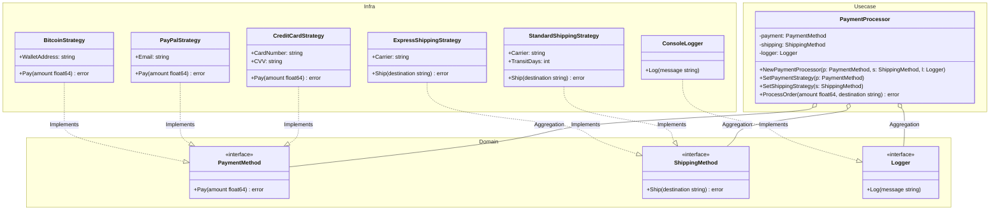

# Go Strategy Pattern Example (Clean Architecture)

このプロジェクトは、**Go**言語を用いて**Strategy Pattern（ストラテジーパターン）**を実装した教育用のサンプルコードです。設計には**Clean Architecture**の原則を取り入れ、依存関係の分離を明確にしています。

## この例で学べること

- 決済・配送の振る舞いをストラテジーとして差し替え、実行時に切り替える流れ
- **「どう支払う/どう配送するか（How）」**は `adapter` に閉じ、`usecase` は **「いつ/何をするか（When/What）」**の業務フローと検証だけを持つ設計
- 副作用（ログ出力）をインターフェースで抽象化し、ビジネスロジックの純粋性を保つ方法
- どのストラテジーを使うかの選択は `main.go`（依存性注入の組み立て場所）で行う

## すぐ試す

`strategy-example` ディレクトリで実行します。

```bash
go run main.go
```

## 🏗 アーキテクチャ構成



### 各レイヤーの役割

1. **Domain (`/domain`)**:
    * **ビジネスルールの核心**です。
    * インターフェース（`PaymentMethod`, `ShippingMethod`, `Logger`）のみを定義し、振る舞いの契約だけを公開します。誰がどうやってそれを実行するかは関知しません。
2. **Usecase (`/usecase`)**:
    * **アプリケーションの進行役（Context）**です。
    * `PaymentProcessor` は Domain のインターフェースに依存しており、具体的な実装を知りません。これにより、ビジネスロジックを変更することなく戦略を差し替えることができ、テスト時のモック注入も容易になります。
3. **Adapter (`/adapter`)**:
    * **具体的な実装（Strategy）**です。
    * Clean Architectureにおける「Interface Adapters」に相当します。
    * `CreditCardStrategy` や `StandardShippingStrategy`、`ConsoleLogger` といった具象クラスを配置します。

## 💡 アーキテクチャ設計ノート (Q&A)

Clean Architectureを学ぶエンジニア向けに、この設計の背後にある重要な意図を解説します。

### Q1. なぜ `usecase` は具体的な実装を直接使ってはいけないのですか？

**A. 「依存性逆転の原則 (DIP)」と「開放/閉鎖の原則 (OCP)」を守るためです。**

もし `usecase` が具体的な実装に直接依存してしまうと、以下の問題が起きます。

1. **変更に弱い**: 新しい手段を追加したい時、`usecase` のコードを書き換えなければなりません。
2. **テストが難しい**: テスト時に本物の決済処理やコンソール出力が発生してしまい、制御が困難になります。

インターフェースに依存させることで、`main.go` で注入する実装を変えるだけで、`usecase` を一切変更せずに挙動を変えることができます。

### Q2. 新しい決済手段や配送方法を追加するには？

**A. 以下の手順で行います。既存コードの修正は不要です。**

1. `adapter` パッケージに新しい構造体を作成する。
2. 必要なインターフェースメソッドを実装する。
3. `main.go` で新しいストラテジーを生成し、注入する。

戦略を切り替えるだけで、複雑な組み合わせをシンプルに差し替えられるのが Strategy Pattern の本領です。

## 🚀 実行方法

strategy-example ディレクトリで以下のコマンドを実行してください。

```bash
go run main.go
```
