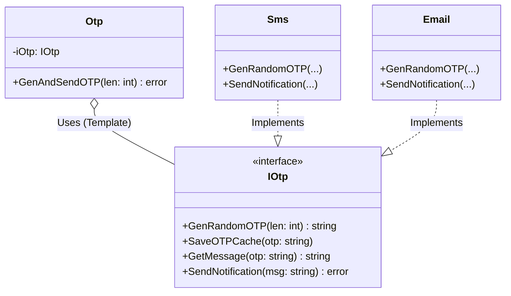

# Go Template Method Pattern Example (Clean Architecture)

This project is an educational sample code that implements the **Template Method Pattern** using the **Go** language. You will learn how to define the "framework (template)" of an algorithm in a parent class (or common structure) and delegate some of the specific steps to subclasses (or implementations).

## What This Example Shows

- Keeping the OTP flow fixed in `Otp.GenAndSendOTP`
- Swapping only specific steps via injected implementations (`Sms`, `Email`)

## Quick Start

In the `template-method-example` directory:

```bash
go run main.go
```

## 🔐 Scenario: OTP (One Time Password) Sending Flow

The procedure for sending an OTP to a user is fixed in the following steps:

1. **Generate a random password (`GenRandomOTP`)**
2. **Save it to the cache (`SaveOTPCache`)**
3. **Create a message (`GetMessage`)**
4. **Send it (`SendNotification`)**

However, the sending methods include "SMS" and "Email," and the implementation details of each step differ.
We want to reuse the common flow while being able to swap out only the different parts.

### Characters

1. **Abstract Class (`domain.IOtp`, `domain.Otp`)**:
    * `Otp` struct: Contains the template method (`GenAndSendOTP`). This is where the flow is controlled.
    * `IOtp` interface: The method definitions for each step.
2. **Concrete Class (`adapter.Sms`, `adapter.Email`)**: Implements `IOtp` and describes its own processing (e.g., calling an SMS sending API).

## 🏗 Architecture



### Role of Each Layer

1. **Domain (`/domain`)**:
    * `Otp`: The skeleton of the algorithm. It guarantees the order "1. Generate -> 2. Save -> 3. Create -> 4. Send."
    * `IOtp`: The specification for pluggable parts.
2. **Adapter (`/adapter`)**:
    * `Sms`, `Email`: The concrete parts. By being injected into the `Otp` struct, they function as part of the algorithm.

## 💡 Architectural Design Notes (Q&A)

### Q1. Go doesn't have inheritance. How is this achieved?

**A. By using "Composition" and "Interfaces."**

In traditional object-oriented languages (like Java), you inherit from a parent class and override methods. In Go, the "Template struct" has an "Interface" member and calls the methods of that interface.
By using embedding (`Embed`) on the implementation side in the `adapter` package, it's also possible to reuse a default implementation in a way that feels like inheritance (as in the `DefaultOtp` example here).

### Q2. Isn't this the same as the Strategy pattern?

**A. It's very similar, but the granularity is different.**

* **Strategy**: Swaps out the **entire** algorithm (e.g., the whole sorting algorithm).
* **Template Method**: **Maintains the structure** of the algorithm while swapping out only **some of the steps**.
  * In terms of Go implementation, since it uses interfaces, it can often be technically indistinguishable from Strategy. The patterns are named differently based on their intent.

## 🚀 How to Run

```bash
go run main.go
```
