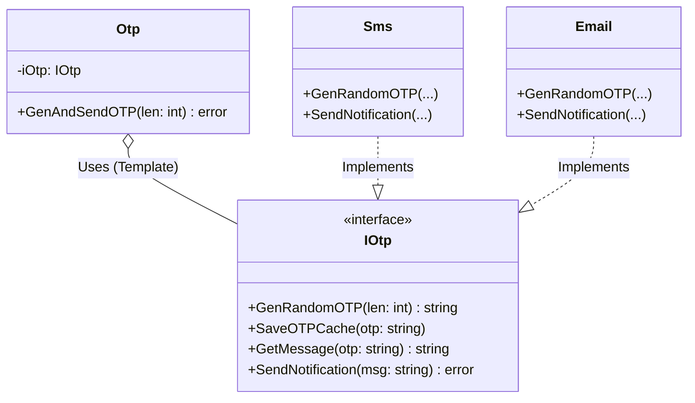

# Go Template Method Pattern Example (Clean Architecture)

このプロジェクトは、**Go**言語を用いて**Template Method Pattern（テンプレートメソッドパターン）**を実装した教育用のサンプルコードです。アルゴリズムの「大枠（テンプレート）」を親クラス（または共通構造）で定義し、一部の具体的なステップをサブクラス（または実装）に任せる方法を学びます。

## 🔐 シナリオ: OTP (One Time Password) 送信フロー

ユーザーにOTPを送る手順は、以下のステップで固定されています。
1.  **ランダムなパスワードを生成する (`GenRandomOTP`)**
2.  **キャッシュに保存する (`SaveOTPCache`)**
3.  **メッセージを作成する (`GetMessage`)**
4.  **送信する (`SendNotification`)**

しかし、送信手段には「SMS」と「Email」があり、それぞれのステップの実装内容は異なります。
共通のフローは再利用しつつ、異なる部分だけを差し替えられるようにします。

### 登場人物
1.  **Abstract Class (`domain.IOtp`, `domain.Otp`)**:
    *   `Otp` struct: テンプレートメソッド（`GenAndSendOTP`）を持ちます。ここでフローを制御します。
    *   `IOtp` interface: 各ステップのメソッド定義です。
2.  **Concrete Class (`adapter.Sms`, `adapter.Email`)**: `IOtp` を実装し、独自の処理（SMS送信APIを呼ぶなど）を記述します。

## 🏗 アーキテクチャ構成



### 各レイヤーの役割

1.  **Domain (`/domain`)**:
    *   `Otp`: アルゴリズムの骨格（スケルトン）。「1.生成 -> 2.保存 -> 3.作成 -> 4.送信」という順序を保証します。
    *   `IOtp`: プラグイン可能なパーツの規格。
2.  **Adapter (`/adapter`)**:
    *   `Sms`, `Email`: 具体的なパーツ。`Otp` 構造体に注入（Inject）されることで、アルゴリズムの一部として機能します。

## 💡 アーキテクチャ設計ノート (Q&A)

### Q1. Goには継承がありませんが、どう実現しているのですか？

**A. 「委譲（Composition）」と「インターフェース」を使います。**

従来のオブジェクト指向言語（Javaなど）では、親クラスを継承してメソッドをOverrideしますが、Goでは「Template構造体」が「Interface」というメンバーを持ち、そのInterfaceのメソッドを呼び出す形にします。
`adapter` パッケージの実装側で `Embed` (埋め込み) を使うことで、デフォルト実装を継承のような感覚で再利用することも可能です（今回の `DefaultOtp` の例）。

### Q2. Strategyパターンと同じではないですか？

**A. 非常に似ていますが、粒度が異なります。**

*   **Strategy**: アルゴリズム**全体**をごっそり入れ替えます（例：ソートアルゴリズム全体）。
*   **Template Method**: アルゴリズムの**構造は維持**したまま、**一部のステップ**だけを入れ替えます。
    *   Goの実装アプローチとしては、インターフェースを使うため技術的にはStrategyとほぼ区別がつかないことも多いです。意図（Intent）の違いで呼び分けます。

## 🚀 実行方法

```bash
go run main.go
```