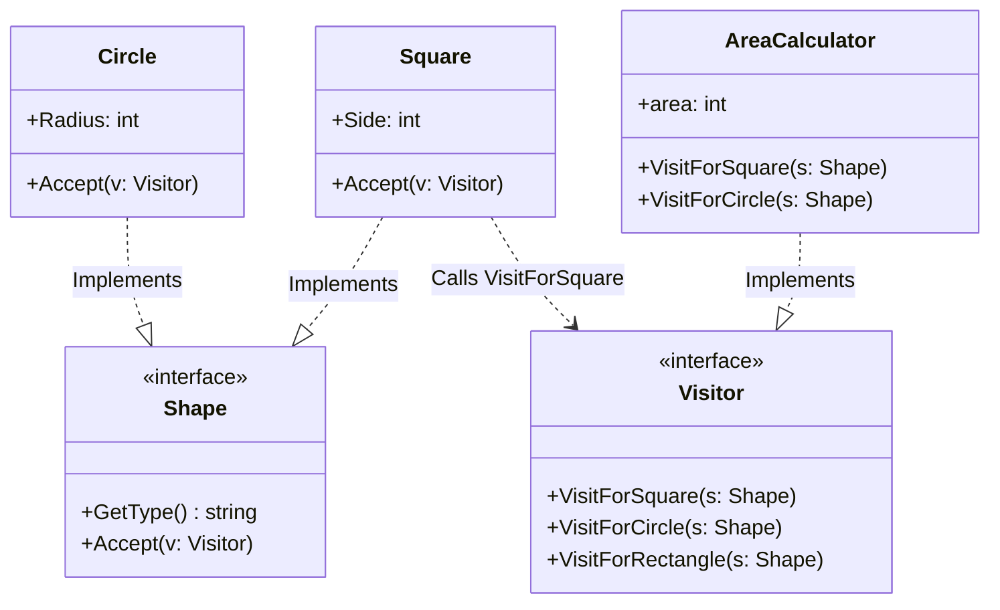

# Go Visitor Pattern Example (Clean Architecture)

This project is an educational sample code that implements the **Visitor Pattern** using the **Go** language. You will learn how to separate a data structure from the operations (processing) performed on it.

## 📐 Scenario: Calculating the Area of Shapes

We have shape classes like "Square," "Circle," and "Rectangle."
Suppose we want to add a feature to "calculate the area" for these shapes.
Normally, you would add a `CalculateArea()` method to each class. However, if you later want to add an "XML output feature" or a "center of gravity calculation feature," modifying all the shape classes each time is a hassle (a violation of the Open/Closed Principle).
Using the Visitor pattern, we will externalize the processing into a separate class called `AreaCalculator`.

### Characters

1. **Element (`domain.Shape`)**: The data structure side. It has an `Accept(v Visitor)` method to accept a visitor.
2. **Visitor (`domain.Visitor`)**: The visitor interface. It defines processing methods for each Element, such as `VisitForSquare`, `VisitForCircle`.
3. **Concrete Visitor (`adapter.AreaCalculator`)**: The actual processing logic (the formula for calculating area).
4. **Concrete Element (`adapter.Square`, `adapter.Circle`)**: The specific shape data. Inside the `Accept` method, they pass themselves to the visitor, like `v.VisitForSquare(self)` (Double Dispatch).

## 🏗 Architecture



### Role of Each Layer

1. **Domain (`/domain`)**:
    * This is where circular dependencies between `Shape` and `Visitor` are likely to occur, but in Go, this is defined by interface definitions.
2. **Adapter (`/adapter`)**:
    * `Square` and others focus on holding data.
    * The calculation logic is consolidated in `AreaCalculator`. If a new process (e.g., `PerimeterCalculator`) is needed, it can be added without changing the `Shape` side.

## 💡 Architectural Design Notes (Q&A)

### Q1. Why call `s.Accept(v)` instead of calling `v.Visit(s)` directly?

**A. To achieve "Double Dispatch."**

In statically typed languages like Go, function overloading (same method name with different argument types) may not be possible, or runtime type resolution can be complex.
By calling `s.Accept(v)`, you can call `v.VisitForSquare(this)` from within a method where the concrete type of `s` (whether it's a Square or a Circle) is already determined, allowing for type-safe and reliable routing to the appropriate processing method.

### Q2. Are there any disadvantages?

**A. It becomes difficult when the number of Element types (variations of Shape) increases.**

If you try to add a `Triangle`, you need to add `VisitForTriangle` to the `Visitor` interface, which requires modifying all Visitor implementation classes (like AreaCalculator).
This pattern is suitable when "the data structure is stable, and operations (processing) are frequently added."

## 🚀 How to Run

```bash
go run main.go
```
