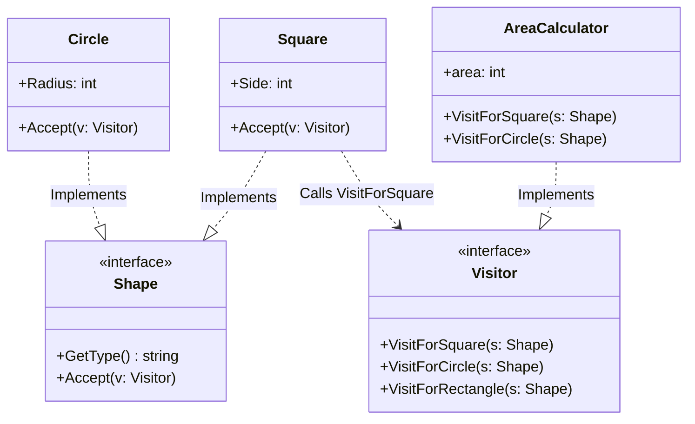

# Go Visitor Pattern Example (Clean Architecture)

このプロジェクトは、**Go**言語を用いて**Visitor Pattern（ビジターパターン）**を実装した教育用のサンプルコードです。データ構造と、それに対する操作（処理）を分離する方法を学びます。

## この例で学べること

- 図形（データ構造）を変えずに処理（Visitor）を追加できること
- `Accept` → `VisitForX` のダブルディスパッチで型ごとに処理を振り分ける流れ

## すぐ試す

`visitor-example` ディレクトリで実行します。

```bash
go run main.go
```

## 📐 シナリオ: 図形の面積計算

「正方形(Square)」「円(Circle)」「長方形(Rectangle)」といった図形クラスがあります。
これらに「面積を計算する」機能を追加したいとします。
通常なら各クラスに `CalculateArea()` メソッドを追加しますが、将来「XML出力機能」や「重心計算機能」などを追加するたびに、全ての図形クラスを修正するのは大変です（開放閉鎖の原則違反）。
Visitorパターンを使って、処理を `AreaCalculator` という別のクラスに外出しします。

### 登場人物
1.  **Element (`domain.Shape`)**: データ構造側。`Accept(v Visitor)` メソッドを持ち、訪問者を受け入れます。
2.  **Visitor (`domain.Visitor`)**: 訪問者インターフェース。`VisitForSquare`, `VisitForCircle` など、各Elementごとの処理メソッドを定義します。
3.  **Concrete Visitor (`adapter.AreaCalculator`)**: 実際の処理ロジック（面積計算の計算式）。
4.  **Concrete Element (`adapter.Square`, `adapter.Circle`)**: 具体的な図形データ。`Accept` メソッド内で `v.VisitForSquare(self)` のように、自分自身を訪問者に渡します（Double Dispatch）。

## 🏗 アーキテクチャ構成



### 各レイヤーの役割

1.  **Domain (`/domain`)**:
    *   `Shape` と `Visitor` の相互依存（Circular Dependency）が発生しやすい箇所ですが、Goではインターフェース定義によってこれを定義します。
2.  **Adapter (`/adapter`)**:
    *   `Square` などはデータ保持に専念します。
    *   `AreaCalculator` に計算ロジックが集約されます。もし新しい処理（例：`PerimeterCalculator`）が必要になっても、`Shape` 側を変更することなく追加できます。

## 💡 アーキテクチャ設計ノート (Q&A)

### Q1. なぜ `v.Visit(s)` と直接呼ばずに `s.Accept(v)` とするのですか？

**A. 「ダブルディスパッチ（Double Dispatch）」を実現するためです。**

Goなどの静的型付け言語では、関数のオーバーロード（引数の型だけ違う同名メソッド）ができない、あるいはランタイムの型解決が複雑になる場合があります。
`s.Accept(v)` を呼ぶことで、`s` の具体的な型（SquareなのかCircleなのか）が確定しているメソッド内で `v.VisitForSquare(this)` を呼ぶことができ、型安全かつ確実に適切な処理メソッドへルーティングできます。

### Q2. デメリットはありますか？

**A. Elementの種類（Shapeのバリエーション）が増えると大変です。**

もし `Triangle` を追加しようとすると、`Visitor` インターフェースに `VisitForTriangle` を追加する必要があり、全てのVisitor実装クラス（AreaCalculatorなど）を修正しなければなりません。
「データ構造は安定していて、処理（操作）が頻繁に増える」場合に適したパターンです。

## 🚀 実行方法

```bash
go run main.go
```
